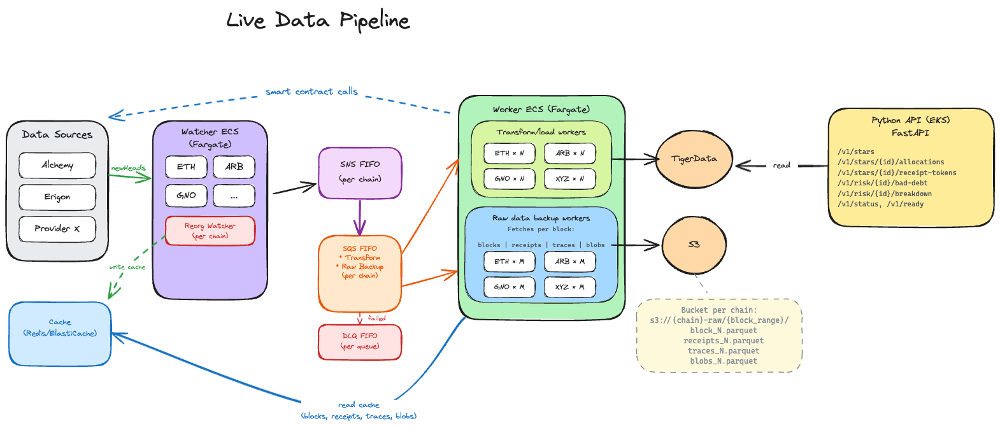

# Contributing to stl

Welcome!

> **TL;DR — the non-negotiables** (read this even if you skip the rest)
> - Pick a category first (see "What goes where" below): worker,
>   cronjob, backfiller, model, or API endpoint — each has a home.
> - **Go/Python** for workers / cronjobs / backfillers. **Python** for APIs
>   and quantitative risk models. Anything else needs prior discussion.
> - **On-chain data should come from chain RPC or our cached block payload, not from third-party indexers or other derived/intermediate feeds.** Off-chain feeds (CoinGecko, DefiLlama, etc.) need a good reason and case-by-case approval from the maintainers.
> - **Keep data pipelines separate from model pipelines** — ingest
>   ≠ compute-meaning. The correct pattern is for data pipelines to write to the data store, and model pipelines to ingest the data needed from that store.
> - Every timeseries table must be a hypertable + compressed + S3-tiered,
>   in the same migration that creates it.
> - **Never modify an applied migration** — write a new one.
> - PR title: `TICKET-1234: <description>`. GitHub squash-merges; don't
>   squash locally.

This document is aimed at anyone who has never seen the repo before — in
particular:

- **contributors of quantitative risk models** (the `app/risk_engine/`
  side)
- **contributors of data pipelines** that ingest on-chain and off-chain
  data (the workers, cronjobs, backfillers)

It explains the layout, how to run things locally, how data acquisition
works, and the conventions you're expected to follow when opening a
pull request.

> If anything here is wrong or unclear, fix it in the same PR as the work
> that surfaced the problem. Docs rot fast — keep them honest.
>
> Stuck on the actual work? Jump to [§16 Getting help](#16-getting-help).

---

## 1. Prerequisites

| Tool | Why | Install |
|---|---|---|
| Go 1.26+ | Every shipped service is Go (`experiments/` is scratch and exempt) | <https://go.dev/dl/> |
| Docker | Local infra (Postgres, Redis, Temporal, LocalStack) | Docker Desktop / Colima |
| [`kind`](https://kind.sigs.k8s.io/) | Runs a Kubernetes cluster inside Docker — mirrors prod | `brew install kind` |
| `kubectl` | Talks to the kind cluster | `brew install kubectl` |
| `kustomize` (optional) | Only needed for manually previewing a deploy (`kustomize build … \| kubectl diff -f -`). `make dev-up` uses `kubectl`'s built-in kustomize. | `brew install kustomize` |
| AWS CLI (optional) | Only needed if you want to fetch real Alchemy keys via `make dev-env` | `brew install awscli` |
| An Alchemy API key | Mainnet access | ask a team member or sign up at alchemy.com |

You do **not** need AWS credentials to develop locally — the kind cluster
runs LocalStack to emulate SNS/SQS/S3.

---

## 2. Five-minute quick start

```bash
git clone git@github.com:archon-research/stl.git
cd stl/stl-verify

# One-time: install lint/test tools.
make tools

# Spin up a full local pipeline (kind cluster, Postgres, Redis,
# LocalStack, Temporal, watcher, workers, cronjobs, python-api).
make dev-up
```

The first run builds every Docker image and takes several minutes. Warm
re-runs skip already-built images; run `make dev-up-rebuild` (alias for
`COLD=1 make dev-up`) to force a rebuild.

When it finishes:

```bash
kubectl --context=kind-vector get pods -n vector
```

Everything should be `Running`. Teardown with `make dev-down`; nuke
persistent volumes too with `make dev-wipe`.

> **⚠️ You need an Alchemy key for anything to actually work.** By
> default `make dev-up` points the watcher at a **mock blockchain
> server** that ships with the repo. The mock is enough to boot the
> cluster and exercise plumbing, but it is **not a fully implemented
> chain** — most RPC methods are stubs, responses are synthetic, and
> any worker that expects realistic block / receipt / trace data will
> produce garbage or fall over.
>
> To run against the real chain, put your key in `.env.secrets` at the
> repo root (the file is created by `make dev-preflight` on first run)
> and switch the cluster over:
>
> ```bash
> make kind-secrets        # propagate .env.secrets into the cluster
> make kind-use-alchemy    # point the watcher at Alchemy instead of the mock
> ```
>
> To go back to the mock (e.g. offline dev): `make kind-use-mock`.

To iterate on a single service without rebuilding the whole cluster, use
the `run-*` targets, which run the binary on your host against the kind
cluster's Postgres/Redis:

```bash
make run-watcher                      # Ethereum live watcher
make run-oracle-price-worker          # Oracle-price per-block worker
make run-sparklend-position-tracker   # SparkLend per-block worker
# ... grep `^run-` in stl-verify/Makefile for the full list
```

If a `run-*` target needs secrets (e.g. `ALCHEMY_API_KEY`), run
`make dev-env` first — it pulls secrets from AWS Secrets Manager and
writes per-service `.env` files.

---

## 3. Repo layout

```text
stl/
├── stl-verify/           # All Go code lives here (single Go module)
│   ├── cmd/              # One subdirectory per binary (see §7)
│   ├── internal/
│   │   ├── domain/       # Business entities — zero dependencies
│   │   ├── ports/        # Interfaces (inbound = use cases, outbound = infra)
│   │   ├── services/     # Use-case implementations
│   │   ├── adapters/
│   │   │   ├── inbound/  # HTTP / gRPC / CLI handlers
│   │   │   └── outbound/ # alchemy, postgres, redis, sns, sqs, s3, temporal…
│   │   └── pkg/          # Cross-cutting helpers (env, telemetry, lifecycle…)
│   ├── db/migrations/    # SQL migrations, applied automatically
│   ├── python/           # Python API (served via k8s)
│   ├── ts/               # TypeScript helpers
│   └── Makefile          # The canonical entry point for every workflow
├── k8s/
│   ├── base/<svc>/       # env-agnostic Kustomize manifests per service
│   └── overlays/{staging,prod}/  # image tags + namespace per environment
├── docs/                 # Protocol specs, ADRs, entity diagrams
├── experiments/          # Scratch — not shipped
└── CLAUDE.md / AGENTS.md # Agent conventions (also at stl-verify/AGENTS.md — worth reading as a human too)
```

**Infrastructure (Terraform/OpenTofu) lives in a separate private repo**
for security reasons. If your change needs new AWS resources (a new SQS
queue, an SNS subscription, an IAM policy, a secret, etc.), the change to
that repo must land **before** the code here can deploy cleanly.

### What goes where

| If you're adding… | It goes in… |
|---|---|
| A **quantitative risk model** (Python) | `stl-verify/python/app/risk_engine/<model>/`, exposed via a service in `app/services/` |
| An **on-chain per-block data pipeline** | `cmd/workers/<name>/` (Go) or `cli/workers/<name>/` (Python) |
| An **off-chain API data pipeline** (periodic) | `cmd/cronjobs/<name>/` (Go) or `cli/cronjobs/<name>/` (Python) |
| A **historical on-chain backfill** | `cmd/backfillers/<name>/` |
| A **new HTTP endpoint** for serving data out | `stl-verify/python/app/api/v1/` (extend the `python-api` service) |
| A **new TimescaleDB schema** (table, index, backfill) | A new migration file under `stl-verify/db/migrations/` |
| A **protocol spec or design doc** | `docs/` |

**Don't touch** `experiments/` (scratch, not shipped), the image tags in
`k8s/overlays/{staging,prod}/kustomization.yaml` (CI owns those).

---

## 4. Language policy — what to write new code in

Pick the language **before** you start, and when in doubt, ask first.

- **APIs are Python.** Anything user- or client-facing —
  endpoints, anything that serves data out to another system —
  belongs in `stl-verify/python/`. The existing `python-api` service is
  the reference; extend it rather than starting a new HTTP server.
- **Workers, cronjobs, and backfillers can be any language you prefer,
  but we strongly prefer Go or Python.** Most of the pipeline is Go
  today (the watcher, all SQS workers, all Temporal cronjobs), which
  means Go is the path of least resistance: shared helpers, the
  `lifecycle.Run`/`temporal.RunCronjob` harnesses, the hexagonal
  scaffolding, the Makefile wiring, and CI are all built around it.
  Python is a fully supported second option.
- **Anything outside Go or Python needs prior discussion.** Open an
  issue or start a thread with
  `@archon-research/vector-engineers` **before** writing code. PRs
  introducing a new runtime (Rust, TypeScript, Java, …) without
  a prior design conversation **may be rejected** regardless of code
  quality — every new language adds build infrastructure, observability
  integration, deployment, dependency-management, and on-call load that
  the team has to absorb forever. That cost is only worth paying when
  we've agreed it is.
- The existing `stl-verify/ts/` is for the frontend/UI (currently being
  built out). That's the established use case; anything else in
  TypeScript still needs prior discussion.

---

## 5. Patterns and anti-patterns

Two rules that apply everywhere in this repo — they override local
convenience:

- **Prefer on-chain data whenever we can.** If the data lives on the
  chain, it should be read from the chain (via Alchemy / Erigon
  and the cached block payload) — it's auditable (we can replay a
  block), trust-minimized (no third party), and stays consistent with
  the rest of the pipeline. Off-chain sources (CoinGecko, Anchorage,
  Etherscan, etc.) are allowed **only with a good reason and with explicit
  approval from the repo maintainers** — e.g., the data only exists
  off-chain. Write the justification in the PR description so that reviewers
  can see it.
- **Data pipelines and model pipelines stay separate.** A **data
  pipeline** writes "what happened on the chain or at an external API"
  into Postgres as append-only time-series. A **model pipeline** reads
  that data from Postgres and writes "what it means" (risk scores, derived metrics,
  liquidation forecasts) into its own tables. Don't merge the two into
  a single worker or cronjob — coupling ingest to model output means
  every model change forces a re-ingest, and every ingest bug
  corrupts the model surface. Split them across separate entry points
  (and usually separate PRs).

---

## 6. Architecture in one picture

The repo follows a **hexagonal (ports and adapters)** architecture.
Dependencies point inward: `domain ← ports ← services ← adapters`, and
`cmd/*` wires concrete adapters into services.



*(Exported from the team Excalidraw board. The ASCII diagram below is
the text-searchable canonical — if it drifts from the image, one of
them is wrong.)*

```text
                                 ┌─► Redis (block cache, 2d TTL)
                                 │
   Alchemy WS ──► watcher ───────┼─► Postgres (block_state)
                                 │
                                 └─► SNS FIFO (one topic per chain)
                                             │
                                             ▼
                                       SQS FIFO queues
                                             │
                            ┌────────────────┼────────────────┐
                            ▼                ▼                ▼
                     oracle-price-    sparklend-       morpho-indexer
                       worker          tracker          (and others)
                            │                │                │
                            └────────────────┴────────────────┘
                                             ▼
                                   Postgres / TimescaleDB
                                   (time-series, append-only)

   Temporal schedules ──► cronjob pods ──► external APIs ──► Postgres
                          (anchorage,       (CoinGecko,
                           offchain-prices,   Anchorage,
                           data-validator)    …)
```

The watcher fans out three independent writes per block: Redis (hot
cache), Postgres (`block_state` bookkeeping), and SNS (the message that
triggers workers). The cache key convention is:

```text
stl:{chainId}:{blockNumber}:{version}:{dataType}
```

where `version` is bumped when a reorg invalidates a block and `dataType`
is one of `block`, `receipts`, `traces`, `blobs`. The SNS/SQS message
only carries a block pointer — workers fetch the actual payload from
Redis using this key.

---

## 7. The `cmd/` tree — where binaries live

Each subdirectory under `cmd/` is one `main.go`. They are grouped by
lifecycle:

| Group | Purpose | Example |
|---|---|---|
| `cmd/base/` | The chain watcher — the **source of block events** | `watcher` |
| `cmd/workers/` | Long-running SQS consumers — **one message per block** | `oracle-price-indexer`, `morpho-indexer`, `sparklend-indexer`, `raw-data-backup` |
| `cmd/cronjobs/` | Long-running Temporal workers triggered on a **schedule** | `offchain-price-indexer`, `anchorage-indexer`, `watcher-data-validator` |
| `cmd/backfillers/` | **One-shot** jobs that fill historical gaps | `oracle-pricing-backfill`, `sparklend-backfill`, `raw-block-bulk-downloader` |
| `cmd/util/` | Dev tooling (`migrate`, `generate-er`, `cronjob-manifest`, stress-test helpers) | — |

If you're adding data acquisition, **pick the category first** — it
determines the plumbing, deployment shape, and tests you'll write.

**Examples:** "Track liquidations on a new lending protocol" → per-block
worker in `cmd/workers/`. "Snapshot an off-chain API every 15 min" →
cronjob in `cmd/cronjobs/`. "Re-ingest last month's oracle prices" →
backfiller in `cmd/backfillers/`.

---

## 8. Data acquisition — per block

This is the hot path: extract something from every new Ethereum (or
Avalanche / Arbitrum / Base / Optimism / Unichain) block.

### How it works

1. **`cmd/base/watcher`** subscribes to `newHeads` over an Alchemy
   WebSocket, fetches the full block (header, receipts, traces, optional
   blobs) via HTTP, writes the raw block into the Redis cache, and
   publishes a `BlockEvent` to an SNS FIFO topic. It also handles reorgs
   by bumping the cache `version` and re-emitting affected blocks.
2. **SNS → SQS FIFO fan-out** (defined in the Infrastructure repo) gives
   each worker its own queue, partitioned by block number for ordered
   processing.
3. **A worker in `cmd/workers/<name>`** pulls a message, reads the cached
   block data from Redis, does its protocol-specific work (e.g. call
   oracle contracts at that block, diff SparkLend positions, etc.), and
   writes rows to Postgres/TimescaleDB.

Every worker follows the same skeleton (`cmd/workers/oracle-price-indexer/main.go`
is the reference):

```go
func run(ctx context.Context, args []string) error {
    cfg, err := parseConfig(args)          // flags + env, fail fast on missing config
    ...
    consumer, err := sqsadapter.NewConsumer(awsCfg, sqsadapter.Config{...}, logger)
    pool, err   := postgres.OpenPool(ctx, postgres.DefaultDBConfig(cfg.dbURL))
    repo, err   := postgres.NewOnchainPriceRepository(pool, logger, buildID, 0)
    service, err := oracle_price_worker.NewService(shared.SQSConsumerConfig{...}, consumer, repo, ...)

    return lifecycle.Run(ctx, logger, service) // runs the consume loop; handles SIGINT/SIGTERM graceful stop
}
```

### Adding a new per-block worker

1. **Create `cmd/workers/<my-worker>/main.go`.** Copy an existing worker
   as a template. Keep `main()` small — it parses flags, wires adapters,
   and calls `lifecycle.Run`.
2. **Create a service in `internal/services/<my_worker>/`.** The service
   owns the business logic, depends only on ports, and exposes a public
   API tested in isolation (mock the repo + consumer + any contract
   caller). Services are expected to have ~100% unit-test coverage.
3. **Add outbound ports/adapters if needed.** A new protocol reader goes
   in `internal/adapters/outbound/<vendor>/`; expose it behind a small
   interface in `internal/ports/outbound/`.
4. **Add migrations** (see §11) for any new tables.
5. **Add k8s manifests** under `k8s/base/<my-worker>/`:
   `deployment.yaml`, `serviceaccount.yaml`, `kustomization.yaml`. Copy
   `k8s/base/oracle-price-worker/` as the template. Wire the new service
   into `k8s/overlays/{staging,prod}/kustomization.yaml`.
6. **Add build/deploy targets to the Makefile** (`docker-build-<name>`,
   `docker-release-<name>`, and register the worker in the `run-*` /
   `kind-load-workers` / `kind-deploy-workers` groupings). Grep for an
   existing worker name in the Makefile to see every site you need to
   touch.
7. **Coordinate with infra.** Open a PR in the Infrastructure repo for
   the SQS queue, SNS subscription, IAM policy, and any secrets — your
   code PR depends on those resources existing.

> **Tip:** It's welcome (often preferred) to split the k8s-manifest and
> Infrastructure-repo changes into a follow-up PR. The code PR stays
> narrowly scoped for engineering review, and the deploy/infra PR stays
> narrowly scoped for the infra owner — each reviewer only sees their
> domain.

### If you're writing the worker in Python

**The flow is identical to the Go version** — same SNS FIFO fan-out,
same SQS FIFO queue, same Redis cache lookup by
`stl:{chainId}:{blockNumber}:{version}:{dataType}`, same Postgres
writes. Only the language changes.

> **No Python SQS worker exists in the repo yet.** If you're the first,
> you'll be introducing the shared plumbing (SQS/Redis adapters,
> Dockerfile, Makefile targets) on top of the business logic — budget
> for it. Put every reusable piece under `app/adapters/…` so the
> second Python worker is copy-paste.
>
> **Tooling:** we use [`uv`](https://docs.astral.sh/uv/) for Python
> packaging and execution — **not** pip, pip-tools, or poetry. Add
> deps with `uv add <pkg>`; run anything under the project env with
> `uv run <cmd>`; refresh the lockfile with `uv sync`.

**Code skeleton** — entry point at `stl-verify/python/cli/workers/<my_worker>/main.py`:

```python
import asyncio
import signal

from app.adapters.postgres import open_pool
from app.adapters.redis import BlockCache           # thin wrapper around redis-py
from app.adapters.sqs import SQSConsumer            # thin wrapper around aioboto3
from app.config import load_config
from app.services.my_worker import MyWorkerService

async def run() -> None:
    cfg = load_config()                             # env-driven, fail fast on missing vars
    consumer = SQSConsumer(cfg.queue_url, cfg.aws_region)
    cache    = BlockCache(cfg.redis_url)
    pool     = await open_pool(cfg.database_url)

    service = MyWorkerService(consumer, cache, pool, chain_id=cfg.chain_id)

    stop = asyncio.Event()
    loop = asyncio.get_running_loop()
    for sig in (signal.SIGINT, signal.SIGTERM):
        loop.add_signal_handler(sig, stop.set)

    try:
        await service.run_until(stop)               # consume loop + per-message handling
    finally:
        await pool.close()

if __name__ == "__main__":
    asyncio.run(run())
```

Run it locally with `uv run python -m cli.workers.<my_worker>.main` (from `stl-verify/python/`).

**Directory layout** — mirrors the Go hexagonal structure (Python uses
`cli/` for entry points where Go uses `cmd/`):

- `stl-verify/python/cli/workers/<my_worker>/main.py` — the **entry
  point** shown above. No business logic here.
- `stl-verify/python/app/services/<my_worker>/` — business logic for
  one block event. Full unit tests; mock the SQS consumer, the Redis
  reader, the repo, and any contract caller.
- `stl-verify/python/app/domain/entities/` — pure entities.
- `stl-verify/python/app/ports/` — interfaces.
- `stl-verify/python/app/adapters/{sqs,redis,postgres,onchain,…}/` —
  concrete implementations, one subpackage per vendor.

**Operational contract** (must match Go workers exactly):

- Long-poll SQS receive; process one message at a time in FIFO order;
  delete on success; let it redrive on failure.
- Handle `SIGINT` / `SIGTERM` — finish the in-flight message, close
  the DB pool, exit within ~25s (the Python equivalent of Go's
  `lifecycle.Run`).
- Read block data from Redis using the exact cache-key convention
  above; do not refetch from Alchemy unless cache-miss rate indicates
  a real bug.

**Adding a new Python per-block worker:**

1. **Create `stl-verify/python/cli/workers/<my_worker>/main.py`** from
   the skeleton above. Keep it small.
2. **Create the service** in `stl-verify/python/app/services/<my_worker>/`
   with full unit tests (mock every adapter).
3. **Add ports/adapters if needed.** A new protocol reader goes in
   `app/adapters/<vendor>/`, exposed via a small interface in
   `app/ports/`. If this is the first Python worker, you'll also
   create `app/adapters/sqs/` and `app/adapters/redis/`.
4. **Add dependencies with `uv`** — e.g. `uv add aioboto3 redis` from
   `stl-verify/python/`. This updates both `pyproject.toml` and
   `uv.lock` atomically.
5. **Add migrations** (see §11) for any new tables.
6. **Add a Dockerfile.** The existing `stl-verify/python/Dockerfile`
   is FastAPI-specific. First Python worker introduces either a
   multi-target Dockerfile (build arg picks `cli/workers/<name>`) or
   a parallel `Dockerfile.worker`. Subsequent workers reuse it.
   Use the `uv` base image pattern already in the existing Dockerfile
   (`COPY --from=ghcr.io/astral-sh/uv …`, `uv sync --frozen --no-dev`).
7. **Add Makefile targets** — `docker-build-<name>`,
   `docker-release-<name>`, `kind-load-<name>`, `kind-deploy-<name>`,
   and a `run-<name>` target for local dev (invokes `uv run` under
   the hood). Follow the pattern of `docker-build-python-api` /
   `docker-release-python-api` in `stl-verify/Makefile`.
8. **Add k8s manifests** under `k8s/base/<my-worker>/`
   (`deployment.yaml`, `serviceaccount.yaml`, `kustomization.yaml`).
   Copy `k8s/base/oracle-price-worker/` as the template; update image
   name and any probes. Register in
   `k8s/overlays/{staging,prod}/kustomization.yaml`.
9. **Coordinate with infra.** Same SQS queue / SNS subscription / IAM
   PR as for a Go worker — the plumbing outside the worker is
   language-agnostic.

> **Tip:** Same as Go workers — split the k8s-manifest and
> Infrastructure-repo changes into a follow-up PR.

---

## 9. Data acquisition — on a cron schedule

Use this when the data source is **not keyed on block height** — typically
an external REST API (CoinGecko, Anchorage) or a periodic consistency
check of our own data.

### How it works

We use **Temporal** for scheduling, not Kubernetes CronJobs. Each cronjob
is a plain Deployment running a Temporal worker that registers a schedule
and an activity on startup:

- The shared runner is `internal/adapters/outbound/temporal.RunCronjob`.
- Schedules are stored in Temporal, not in k8s. On startup the worker
  calls `ScheduleClient().Create` — if it already exists, Temporal
  returns `AlreadyExists` and we carry on.
- Changing the interval env var **does not take effect automatically**:
  you must delete the schedule in Temporal (UI or CLI) and restart the
  worker. This is intentional — schedules are Temporal state, not k8s
  state.

A minimal cronjob (`cmd/cronjobs/offchain-price-indexer/main.go`):

```go
func main() {
    ctx, cancel := signal.NotifyContext(context.Background(), syscall.SIGINT, syscall.SIGTERM)
    defer cancel()

    err := temporal.RunCronjob(ctx, temporal.BuildMeta{...}, temporal.CronjobConfig{
        Name:            "offchain-price-indexer",  // → task queue, schedule ID
        IntervalEnv:     "PRICE_FETCH_INTERVAL",    // overrideable at runtime
        IntervalDefault: "5m",
        OpenDatabase:    postgres.PoolOpener(postgres.DefaultDBConfig(env.Get("DATABASE_URL", ...))),
        Setup:           setupRunner,               // returns temporal.Runner
    })
    if err != nil { slog.Error("fatal", "error", err); os.Exit(1) }
}

func setupRunner(ctx context.Context, deps temporal.Dependencies) (temporal.Runner, error) {
    // Build your service here; return a Runner whose Run(ctx) is the body
    // of one tick. Temporal wraps it in an activity + workflow for you.
}
```

### Adding a new cronjob

1. **Create `cmd/cronjobs/<my-cronjob>/main.go`** using the skeleton
   above. Pick a sensible default interval — err towards longer, and
   always make it overrideable via an env var.
2. **Put the business logic in `internal/services/<my_cronjob>/`** with
   full unit tests (mock external HTTP clients).
3. **Add k8s manifests** under `k8s/base/<my-cronjob>/`:
   `deployment.yaml`, `serviceaccount.yaml`, `kustomization.yaml`. Copy
   `k8s/base/offchain-price-indexer/` as the template — cronjob
   Deployments are small (50m/64Mi requests) because the work happens
   inside Temporal activities. Register the service in
   `k8s/overlays/{staging,prod}/kustomization.yaml`.
   A skeleton generator is available via
   `go run ./cmd/util/cronjob-manifest` if you'd rather start from
   generated YAML.
4. **Add a `docker-build-cronjob-<name>` target** to the Makefile (follow
   the pattern — most of the wiring is automatic thanks to the
   `CRONJOBS := ...` glob in `stl-verify/Makefile`).
5. **Infra PR** for any new secrets/IAM + a Temporal namespace entry if
   needed.

> **Tip:** As with workers, splitting the k8s-manifest and
> Infrastructure-repo changes into a follow-up PR keeps each review
> narrow and domain-scoped.

Cronjobs are **idempotent by design** — a tick may be retried by
Temporal. Your service must tolerate running twice on the same window
without producing duplicates.

### If you're writing the cronjob in Python

**The flow is identical to the Go version** — Temporal is still the
scheduler, the worker registers a schedule on startup, and each tick
runs one activity. Only the language changes. Same `uv` tooling rules
as the worker section above.

> **No Python Temporal worker exists in the repo yet.** If you're the
> first, factor the boilerplate (client connect, schedule ensure,
> worker run) into a shared harness at `app/adapters/temporal/` so the
> second one is copy-paste.

**Code skeleton** — entry point at `stl-verify/python/cli/cronjobs/<my_cronjob>/main.py`.
Uses the [`temporalio`](https://pypi.org/project/temporalio/) SDK:

```python
import asyncio
import os
from datetime import timedelta

from temporalio.client import (
    Client, Schedule, ScheduleActionStartWorkflow,
    ScheduleIntervalSpec, ScheduleSpec,
)
from temporalio.service import RPCError
from temporalio.worker import Worker

from app.config import load_config
from app.services.my_cronjob import MyCronjobService, tick_workflow

NAME     = "my-cronjob"
INTERVAL = timedelta(minutes=int(os.getenv("MY_CRONJOB_INTERVAL_MIN", "15")))

async def run() -> None:
    cfg     = load_config()
    client  = await Client.connect(cfg.temporal_host, namespace=cfg.temporal_namespace)
    service = MyCronjobService(cfg)                 # wires DB + HTTP clients

    # Idempotent schedule creation — swallow AlreadyExists on restarts.
    try:
        await client.create_schedule(
            NAME,
            Schedule(
                action=ScheduleActionStartWorkflow(
                    tick_workflow,
                    id=f"scheduled-{NAME}",
                    task_queue=NAME,
                ),
                spec=ScheduleSpec(intervals=[ScheduleIntervalSpec(every=INTERVAL)]),
            ),
        )
    except RPCError as e:
        if "AlreadyExists" not in str(e):
            raise

    worker = Worker(
        client,
        task_queue=NAME,
        workflows=[tick_workflow],
        activities=[service.tick],
    )
    await worker.run()

if __name__ == "__main__":
    asyncio.run(run())
```

Run it locally with `uv run python -m cli.cronjobs.<my_cronjob>.main` (from `stl-verify/python/`).

**Directory layout** (mirrors Go; `cli/` ≈ `cmd/`):

- `stl-verify/python/cli/cronjobs/<my_cronjob>/main.py` — entry point
  (above). No business logic.
- `stl-verify/python/app/services/<my_cronjob>/` — business logic,
  the body of one tick, plus the `tick_workflow` wrapper. Full unit
  tests; mock external HTTP clients.
- `stl-verify/python/app/domain/entities/` — pure entities.
- `stl-verify/python/app/ports/` — interfaces.
- `stl-verify/python/app/adapters/{postgres,onchain,temporal,…}/` —
  concrete implementations, one subpackage per vendor.

**Temporal contract** (must match Go cronjobs exactly):

- Task queue, schedule ID, and workflow ID all derive from the cronjob
  name (lowercase, hyphenated).
- Interval read from `<NAME>_INTERVAL` env var with a sensible default
  — prefer longer, and always overrideable.
- Create the schedule on startup; swallow `AlreadyExists`; changing
  the interval still requires deleting the schedule in Temporal and
  restarting the worker.
- The activity must be **idempotent** — Temporal retries. Guard every
  write against duplicates.

**Adding a new Python cronjob:**

1. **Create `stl-verify/python/cli/cronjobs/<my_cronjob>/main.py`**
   from the skeleton above.
2. **Create the service** in `stl-verify/python/app/services/<my_cronjob>/`
   with unit tests (mock HTTP / repo adapters). Put the
   `tick_workflow` wrapper here or in `app/adapters/temporal/` if it's
   generic.
3. **Add ports/adapters** for any new external client.
4. **Add dependencies with `uv`** — e.g. `uv add temporalio` (and
   `httpx` if you need a new HTTP client, though it's already in).
   Run from `stl-verify/python/`; updates `pyproject.toml` and
   `uv.lock` together.
5. **Add migrations** (see §11) for any new tables.
6. **Dockerfile & Makefile targets** — same situation as Python
   workers; the first Python cronjob introduces the shared plumbing
   (use the `uv` base image pattern already in `stl-verify/python/Dockerfile`).
7. **Add k8s manifests** under `k8s/base/<my-cronjob>/`. Copy
   `k8s/base/offchain-price-indexer/` as the template (small:
   50m/64Mi, because the work happens inside the activity). Register
   in `k8s/overlays/{staging,prod}/kustomization.yaml`.
8. **Infra PR** for any new secrets / IAM + a Temporal namespace entry
   if needed.

> **Tip:** Same as with workers — split the k8s-manifest and
> Infrastructure-repo changes into a follow-up PR.

Idempotency and migration rules above still apply.

---

## 10. Adding a new risk model

Risk models are Python and live under
`stl-verify/python/app/risk_engine/<model>/`. Every model exposes the
same contract: **Required Risk Capital (RRC) in USD**, computed at the
model's documented default stress and overrideable via a scenario map.
Many models are expected, and more than one may apply to the same
`(asset_id, prime_id)` — the API returns all applicable results in one
response.

Two families exist today and illustrate the range:

- **Asset-level rating (`risk_engine/suraf/`)** — pre-computed CRR per
  asset; `RRC = usd_exposure × CRR`. Default `usd_exposure` derived
  from `prime_id`.
- **Position-level (`risk_engine/crypto_lending/`)** — reads collateral
  state via ports; RRC computed under a default x% gap between
  liquidation trigger and execution.

### Where code goes

```text
app/risk_engine/<model>/          # Pure math. No I/O.
app/ports/                        # One `-er` interface per data dependency
app/adapters/{postgres,onchain}/  # One adapter per protocol variant
app/services/<model>_service.py   # Wraps math + ports; implements compute(...)
app/api/v1/risk.py                # The two routes below. Never import risk_engine/ here.
```

### API contract — two routes cover every model

Both return `{ asset_id, prime_id?, results: [{ version, model, rrc_usd, details }, ...] }`.
Each `details` is a discriminated union keyed on `model`.
Version is a reference to block_version and processing_version. These allow auditability of the results.

- `GET /v1/risk/rrc?asset_id=…&prime_id=…` — every applicable model at
  its defaults.
- `POST /v1/risk/rrc` with `{ asset_id, prime_id?, overrides: { <model>: {...knobs} } }`
  — same, with per-model scenario overrides. Unknown models/keys → 422.

### Model-side interface

Every service implements
`compute(asset_id, prime_id, overrides) -> RrcResult`, with defaults
and override schema documented in its docstring. A registry in
`app/services/` maps `(asset_id, prime_id)` to the set of applicable
services — handlers iterate the registry, never branch on model.

### Startup and tests

Anything loaded once (rating packages, mappings) goes in
`app/main.py::create_app` **before** resources are acquired, so a bad
config fails startup, not a request. Stash on `app.state.<name>`,
expose via `app/api/deps.py`. Unit-test services with mocked ports;
integration-test the endpoint against real Postgres (testcontainers) —
mock only third-party APIs. Migrations for any new tables: see §11.

---

## 11. Database migrations

A **migration** is a single SQL file that makes one versioned change to
the database schema (create or alter a table, add an index, backfill a
column, etc.). The migrator tracks which files have already run, by
checksum, and applies any new ones in order — so "adding a migration"
is how you roll a schema change out to every environment reproducibly.

Migrations live in `stl-verify/db/migrations/` and are applied
automatically — by the migrator Job on `make dev-up`, and by the
ArgoCD PreSync hook in staging/prod.

**Rules (non-negotiable):**

1. **Filename:** `YYYYMMDD_HHMMSS_description.sql` (use `date +"%Y%m%d_%H%M%S"`).
2. **Plain SQL only**, ending with a self-tracking insert:
   ```sql
   INSERT INTO migrations (filename) VALUES ('20260420_120000_my_change.sql')
   ON CONFLICT (filename) DO NOTHING;
   ```
3. **Never modify an applied migration.** The migrator checksums every
   file; a changed checksum fails the deploy. To fix a mistake, write a
   new migration.
4. **Every timeseries table is a hypertable, tiered to S3, and
   compressed.** Without exception. All three are set up in the same
   migration that creates the table — don't ship a naked table and
   "add the policies later". Specifically:
   - **Hypertable** via `SELECT create_hypertable(...)` (or the
     distributed-hypertable equivalent). Pick a chunk interval that
     matches the ingest rate — too small and planning cost dominates,
     too large and compression and S3 tiering can't evict anything.
   - **Compression policy** via `ALTER TABLE ... SET (timescaledb.compress, ...)`
     plus `SELECT add_compression_policy(...)`. Choose
     `segmentby`/`orderby` columns that reflect how the table is
     queried — getting this wrong costs 10–100× on reads.
   - **Tiered-storage (S3) policy** via `SELECT add_tiering_policy(...)`.
     This is what keeps the hot Postgres volume small; skipping it is
     how we run out of disk in prod.
   Also: primitives must be compatible with **distributed** hypertables.
   When in doubt, read `docs/data_entities.md` and ADR-0002, or copy
   the most recent timeseries migration as a template.
5. Use `CREATE INDEX CONCURRENTLY` on big tables. Test on staging first.

---

## 12. Testing

| Command | What it runs | When you need it |
|---|---|---|
| `make test` | Unit tests | Everyday dev |
| `make test-race` | Unit tests with `-race` | What CI runs — run before pushing |
| `make test-integration` | Tests tagged `integration` (requires Docker — uses testcontainers) | Anything touching Postgres, Redis, SQS, S3 |
| `make e2e` | End-to-end watcher tests | Changes to the live/backfill pipeline |
| `make cover` / `make cover-all` | Coverage report | When working on a service with a coverage goal |

**Philosophy:**

- **Services are the unit under test.** Test only the public API; mock
  outbound ports with small handwritten fakes. Use table-driven tests.
  Services and `main.go` files should strive for 100% coverage on meaningful
  code paths. The only exceptions are branches that genuinely can't be
  exercised (generated code, OS-specific shims, truly unreachable
  error branches); each exception should be justified in the PR.
- **Integration tests may only mock things we do not control.** Alchemy
  and other third-party APIs: mock. Our Postgres, our Redis, our SQS:
  use the real thing (via testcontainers) — mocking them has bitten us
  in production.
- For `main.go`, extract a `run(ctx, args) error` function and call it
  from `main()` — then the integration test calls `run` directly.

**Python code uses its own Makefile and `uv`.** We use
[`uv`](https://docs.astral.sh/uv/) as the Python package manager and
runner — **not** pip, pip-tools, or poetry. `uv sync` installs deps
from `uv.lock`; `uv add <pkg>` adds a dep; `uv run <cmd>` runs
anything under the project env.

Commands for `stl-verify/python/` live in `stl-verify/python/Makefile`
(each one wraps `uv run`), run from that directory:

| Command | What it runs |
|---|---|
| `make test-unit` | Python unit tests (`uv run pytest tests/unit`) |
| `make test-integration` | Python integration tests (Docker needed) |
| `make lint` / `make lint-fix` | Ruff check / autofix |
| `make run` | Start the FastAPI server locally |

The root `stl-verify/Makefile` targets in the table above only cover
Go code.

---

## 13. Code conventions

Most of these are also spelled out in [CLAUDE.md](./CLAUDE.md) and
[stl-verify/AGENTS.md](./stl-verify/AGENTS.md), which apply to humans too.

- **Hexagonal boundaries.** Domain has zero imports outside the standard
  library. `services/` depends on `ports/`, never on `adapters/`.
  Adapters are dumb — no business logic.
- **Interfaces** use the `-er` suffix (`Reader`, `Publisher`, `Multicaller`).
- **Constructors** are `NewFoo(...)`.
- **Files** are `snake_case.go`.
- **Errors:** wrap with context — `fmt.Errorf("fetching block %d: %w", n, err)`.
  Never ignore an error. Prefer returning the error over continuing.
- **Prefer the standard library.** Pull in a dependency only when the
  stdlib equivalent is materially worse. De-duplicate by extracting a
  helper, not by copy-paste.
- **Keep `main()` at the top of the file** and small — it should read
  like prose. Extract helpers aggressively.
- **No global state, no singletons.** Inject everything through
  constructors.
- **Binaries** built with `go build` go into `stl/dist/` (gitignored).

---

## 14. Pull request workflow

1. **Branch off `main`.** Name the branch after the Linear ticket if
   there is one (`VEC-123-short-slug`).
2. **Open a PR early** — drafts are fine. The `CODEOWNERS` file
   auto-requests review from `@archon-research/vector-engineers`.
3. **Before you push**, run:
   ```bash
   cd stl-verify
   make ci                  # lint + static + vuln + unit + race
   make test-integration    # if you touched anything data-adjacent
   ```
   CI runs the same commands. A CI run that modifies files (e.g. a
   stray `go mod tidy` diff) is a hard fail — commit the result locally.
4. **PR title format: `TICKET-1234: <good description>`** — e.g.
   `VEC-123: Add SparkLend position tracker`. The ticket prefix is how
   we link PRs to Linear and find things later; the description should
   say what the PR *does*, not what it *is* (prefer
   `VEC-123: Backfill oracle prices for new Aave markets` over
   `VEC-123: Oracle changes`). Commit messages can be whatever you like
   — **do not bother squashing WIP commits locally**, GitHub is
   configured for squash-and-merge, so the PR title becomes the commit
   message on `main` and your intermediate commits are discarded
   automatically.
5. **Merge to `main`** — CI then triggers `.github/workflows/deploy.yaml`,
   which bumps image tags in `k8s/overlays/staging/kustomization.yaml`
   and ArgoCD rolls the change into the `vector` namespace on the
   staging EKS cluster. Prod is a separate manual promotion (bump the
   tag in `k8s/overlays/prod/kustomization.yaml`).

---

## 15. Things that will save you time

- **Read the Makefile directly** — `stl-verify/Makefile` is the source
  of truth for every workflow and has many more targets than are
  documented here (Erigon management, bulk downloads, stress tests,
  bastion tunnels, …). Grep the top of the file or search for the
  target name you're after; there is no `make help`.
- **Look at existing examples before inventing a pattern.** Every
  category (`workers/`, `cronjobs/`, `backfillers/`) has a reference
  implementation that wires the adapters in the approved way. Copy it.
- **Secrets never go in git.** Local secrets live in `.env.secrets` at
  the repo root (gitignored, created by `make dev-preflight`). Cloud
  secrets live in AWS Secrets Manager and are pulled by `make dev-env`.
- **If you're stuck on infra**, contact the vector team.

---

## 16. Getting help

- **Code questions / design review:** `@archon-research/vector-engineers`
  on GitHub, or [`#proj-verify-beacon`](https://sentinel-0rx1449.slack.com/archives/C0AN04V9NGZ)
  on Laniakea Slack (review is required anyway — ask early).
- **Protocol specs:** see `docs/` — `aave_v3_spec.md`, `morpho_spec.md`,
  `sparklend_spec.md`, etc.
- **Architecture decisions:** `docs/adr/` holds the short record of why
  we chose kind over Minikube, why every row is versioned, and so on.
- **Anything else / general questions:** [`#proj-verify-beacon`](https://sentinel-0rx1449.slack.com/archives/C0AN04V9NGZ)
  on Laniakea Slack.

Thanks for contributing — ship data-correct code and we'll all sleep
better.
