# Terraform to AWS Architecture Diagram Generator

A Python automation tool that reads your Terraform files and generates visual AWS architecture diagrams.

## Features

- 🔍 **Parses Terraform HCL files** - Extracts resources from your `.tf` configuration files
- 📊 **Generates Mermaid diagrams** - Creates visual architecture diagrams
- 🎨 **Multiple export formats** - Markdown, HTML, or raw Mermaid
- 🏷️ **AWS service grouping** - Organizes resources by AWS service
- 🔗 **Dependency detection** - Shows connections between resources
- 📱 **Responsive HTML output** - Beautiful standalone HTML visualizations

## Installation

No additional dependencies required beyond Python 3.7+. The tool uses only Python standard library.

```bash
cd /Users/angelostheodosiadis/workspace/stl
```

## Usage

### Basic Usage

Generate an architecture diagram from your Terraform files:

```bash
# Generate as Markdown (default)
python3 terraform-diagram-generator.py infra/ --output architecture.md

# Generate as HTML
python3 terraform-diagram-generator.py infra/ --format html --output architecture.html

# Generate raw Mermaid
python3 terraform-diagram-generator.py infra/ --format mermaid
```

### Using the Quick Script

```bash
# From the workspace root
chmod +x generate-diagram.sh
./generate-diagram.sh
```

This generates `architecture-diagram.md` with your infrastructure diagram.

### Command Options

```
usage: terraform-diagram-generator.py [-h] [--output OUTPUT] [--format {markdown,html,mermaid}] [--title TITLE] terraform_dir

positional arguments:
  terraform_dir         Path to Terraform directory

optional arguments:
  -h, --help            show this help message and exit
  --output OUTPUT       Output file path (default: terraform-architecture.md)
  --format {markdown,html,mermaid}
                        Output format (default: markdown)
  --title TITLE         Diagram title
```

## Output Examples

### Markdown Output
Creates a `.md` file with embedded Mermaid diagram - viewable on GitHub, GitLab, and most markdown editors.

### HTML Output
Creates a standalone `.html` file with interactive Mermaid rendering - can be opened directly in a browser.

### Mermaid Output
Generates raw Mermaid syntax - useful for embedding in other tools.

## How It Works

1. **Parser** (`TerraformParser`)
   - Scans all `.tf` files in the specified directory
   - Uses regex to extract resource definitions
   - Extracts properties like names, images, engines, etc.

2. **Generator** (`MermaidDiagramGenerator`)
   - Groups resources by AWS service
   - Creates a Mermaid graph with subgraphs per service
   - Detects and visualizes resource dependencies
   - Applies AWS brand colors and icons

3. **Exporter** (`DiagramExporter`)
   - Wraps diagrams in Markdown, HTML, or raw format
   - Includes styling and formatting

## Example Output

```mermaid
graph TB
    subgraph VPC["AWS VPC"]
        aws_vpc_main["🌐 vpc<br/>stl-staging-vpc"]
        aws_internet_gateway_main["🌐 internetgateway<br/>stl-staging-igw"]
    end
    
    subgraph ECS["AWS ECS"]
        aws_ecs_cluster_main["📦 ecs<br/>stl-staging-cluster"]
        aws_ecs_service_watcher["📦 ecs<br/>stl-staging-watcher"]
    end
    
    classDef network fill:#4B9BFF,stroke:#232F3E,stroke-width:2px,color:#fff
    classDef awsService fill:#FF9900,stroke:#232F3E,stroke-width:2px,color:#fff
    class aws_vpc_main,aws_internet_gateway_main network
    class aws_ecs_cluster_main,aws_ecs_service_watcher awsService
```



## Integration with CI/CD

### GitHub Actions Example

```yaml
name: Generate Architecture Diagram

on:
  push:
    paths:
      - 'infra/**'
      - '.github/workflows/diagram.yml'

jobs:
  generate:
    runs-on: ubuntu-latest
    steps:
      - uses: actions/checkout@v3
      - uses: actions/setup-python@v4
        with:
          python-version: '3.11'
      - run: python3 terraform-diagram-generator.py infra/ --output docs/architecture.md
      - uses: actions/upload-artifact@v3
        with:
          name: architecture-diagram
          path: docs/architecture.md
```

## Makefile Integration

Add to your Makefile:

```makefile
diagram:
	@echo "==> Generating AWS architecture diagram..."
	python3 terraform-diagram-generator.py infra/ --format html --output docs/architecture.html
	@echo "✓ Diagram generated: docs/architecture.html"

diagram-watch:
	@echo "==> Watching infra/ for changes..."
	while true; do \
		fswatch -o infra/ | xargs -n1 -I {} sh -c 'make diagram'; \
	done
```

Then run:
```bash
make diagram          # Generate once
make diagram-watch    # Auto-generate on changes
```

## Limitations

- Simple regex-based parsing (not a full HCL2 parser)
- Does not handle complex nested structures perfectly
- Resource dependencies are based on predefined patterns
- Requires well-formatted Terraform code

## Future Enhancements

- [ ] Support HCL2 parser library for more accurate parsing
- [ ] Add support for Terraform modules
- [ ] Generate CloudFormation diagrams
- [ ] Export to PlantUML format
- [ ] Add resource cost estimation
- [ ] Support for cross-account architectures
- [ ] Interactive diagram with filtering

## License

MIT
