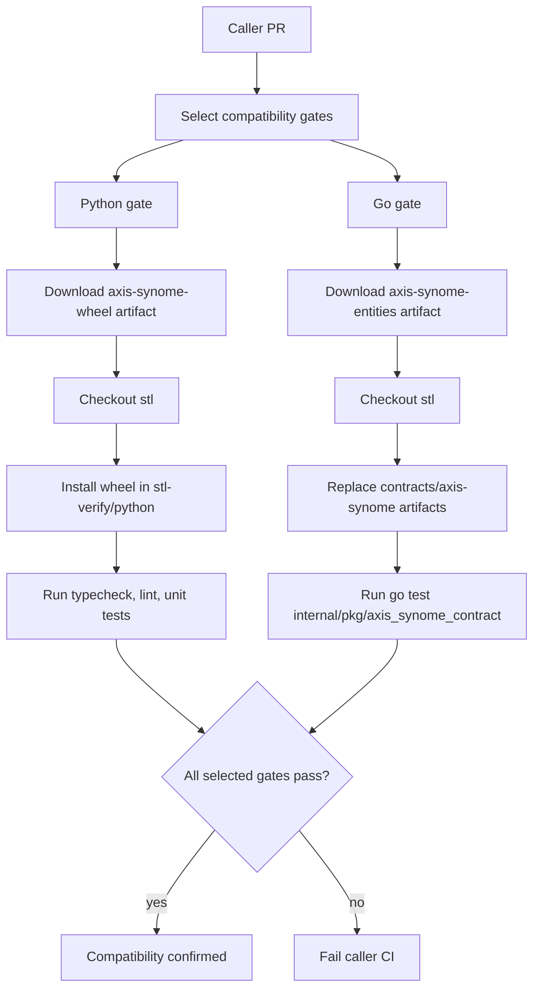

# ADR-0004: Sentinel Verify Compatibility CI via Reusable Workflows

**Status**: Accepted
**Proposed**: @r0hitsharma
**Date**: 2026-05-21
**Deciders**: @vector, @tensor

## Context

`axis-synome` changes can break Sentinel Verify in two places:

- Python runtime integration in `stl-verify/python`.
- Go contract consumption in `stl-verify/internal/pkg/axis_synome_contract`.

Current state: Go application code does not yet rely on runtime imports or direct execution from `axis-synome`.
The Go side currently validates compatibility at the contract boundary (exported entities JSON + schema and
the stl loader package).

Planned direction: stl Go services will consume axis-synome entities in a follow-up implementation. This ADR
defines the integration checks and ownership boundaries ahead of that adoption.

A module can pass its own CI and still fail in downstream integration. We need a reusable compatibility gate owned by `archon-research/stl` so callers validate against Sentinel Verify before merge.

## Decision

Expose two reusable workflows with the same call model (checkout stl, download caller-produced artifact, run gate), while keeping language-specific setup and commands isolated:

- `.github/workflows/python-sentinel-verify-compatibility.yml`
- `.github/workflows/go-sentinel-verify-compatibility.yml`

Why two workflows instead of one multi-language workflow:

- Python and Go setup/tooling are different enough that a single workflow would carry conditional complexity and weaker readability.
- Separate workflows keep contracts simple and stable per language.
- Callers can run either or both jobs explicitly.
- This ADR intentionally scopes to compatibility verification and boundary definition; service-level Go entity
  consumption is explicitly deferred to follow-up work.

## Shared Contract Pattern

Each reusable workflow supports:

- `stl_ref` (default `main`) for target stl revision.
- Caller-provided artifacts with fixed, language-specific names.
- Strict failure on gate command/test failures.

## Language-Specific Gates

Python workflow (`python-sentinel-verify-compatibility.yml`):

- Consumes artifact `axis-synome-wheel`.
- Replaces `axis-synome` in `stl-verify/python` by installing the built wheel.
- Runs:
  - `make typecheck`
  - `make lint`
  - `make test-unit`

Go workflow (`go-sentinel-verify-compatibility.yml`):

- Consumes artifact `axis-synome-entities`.
- Replaces contract artifacts under `stl-verify/contracts/axis-synome/`.
- Runs:
  - `go test ./internal/pkg/axis_synome_contract`

## Security and Supply Chain

- Workflows use read-only repository permissions.
- Third-party actions are pinned by commit SHA.
- Default stl target is `main`; callers may explicitly pin a compatibility branch/ref.
- No private-source assumptions in v1.

## Consequences

Positive:

- Compatibility breakages are detected in caller PRs before merge.
- Single, stl-owned source of truth for downstream compatibility gates.
- Python and Go compatibility can evolve independently without workflow sprawl.

Trade-offs:

- Extra CI time in caller repositories.
- Caller repos must publish required artifacts with the expected names.
- v1 focuses on module/contract replacement and does not run broad integration test suites.

## Non-Goals

- Running full integration/E2E tests in compatibility workflows.
- Supporting arbitrary remote package/spec installs.
- Publishing artifacts from `stl`.
- Implementing service-level Go consumption of axis-synome entities in this change; that implementation is follow-up work.

## Caller Example (axis-synome)

```yaml
jobs:
  build-axis-artifacts:
    runs-on: ubuntu-latest
    steps:
      - uses: actions/checkout@v6
      - uses: astral-sh/setup-uv@v8.1.0
      - run: make build
      - run: |
          cd python/axis_synome
          uv run python scripts/export_entities.py \
            --out generated/stl/axis_synome_entities.json \
            --schema-out generated/stl/axis_synome_entities.schema.json
      - uses: actions/upload-artifact@v4
        with:
          name: axis-synome-wheel
          path: python/axis_synome/dist/*.whl
      - uses: actions/upload-artifact@v4
        with:
          name: axis-synome-entities
          path: |
            python/axis_synome/generated/stl/axis_synome_entities.json
            python/axis_synome/generated/stl/axis_synome_entities.schema.json

  stl-compat-python:
    needs: build-axis-artifacts
    uses: archon-research/stl/.github/workflows/python-sentinel-verify-compatibility.yml@main
    with:
      stl_ref: main

  stl-go-compat-artifact:
    needs: build-axis-artifacts
    uses: archon-research/stl/.github/workflows/go-sentinel-verify-compatibility.yml@main
    with:
      stl_ref: main
```

## Flow


