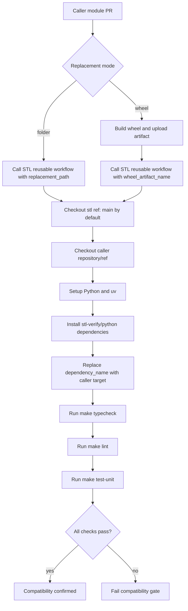

# ADR-0004: Sentinel Verify Compatibility CI via Reusable Workflow

**Status**: Accepted
**Proposed**: @r0hitsharma
**Date**: 2026-05-21
**Deciders**: @vector, @tensor

## Context

`stl-verify/python` depends on external Python modules and runs strict quality checks (`ty`, `ruff`, unit tests). A module can be valid in its own repository but still break compatibility with Sentinel Verify.

Today, this compatibility check is mostly validated after publishing or by manual local testing. That creates avoidable regressions and slower feedback loops.

We want a reusable CI entrypoint owned by this repository so external repositories can validate compatibility against Sentinel Verify before merge. `axis-synome` is the first adopter of this compatibility gate.

## Decision

This repository will expose a reusable GitHub Actions workflow that other repositories can call.

The workflow will:

- Checkout this repository (`archon-research/stl`) at `main` by default.
- Allow callers to override the stl ref (`stl_ref`) when needed.
- Checkout the caller repository so it can provide replacement artifacts.
- Replace a target module dependency in `stl-verify/python` using one of two v1 modes:
  - `folder`: install from a caller-provided folder path.
  - `wheel`: install from a caller-provided wheel path.
- Run the compatibility gate in `stl-verify/python`:
  - `make typecheck`
  - `make lint`
  - `make test-unit`

Any failing gate command fails the workflow.

## Reusable Workflow Contract

Inputs:

- `stl_ref` (default: `main`): ref of `archon-research/stl` to test against.
- `replacement_mode` (required): `folder` or `wheel`.
- `replacement_path` (required): path pattern for folder/wheel replacement target.
- `dependency_name` (default: `axis-synome`): package/module name to replace (callers should set this for their module).
- `caller_repository` (default: caller repository): optional override for manual and local test runs.
- `caller_ref` (default: caller SHA): optional override for manual and local test runs.
- `wheel_artifact_name` (optional): artifact name to download wheel files from when using `wheel` mode.
- `python_version` (default: `3.12`): Python version used for the compatibility job.

Behavior:

1. Clone `archon-research/stl` at `stl_ref`.
2. Clone caller repository at caller SHA (or caller override ref).
3. Install stl Python dependencies with `uv sync --all-extras`.
4. Optionally download wheel artifact when `wheel_artifact_name` is provided.
5. Replace `dependency_name` using `replacement_mode` and `replacement_path`.
6. Execute compatibility gate commands.

## Security and Supply Chain

- The workflow uses read-only repository permissions.
- Third-party actions should remain pinned by commit SHA.
- Default behavior tests against `main`; callers can opt into explicit ref overrides.
- This is compatible with open-source repository checkout (no private source fetch assumptions in v1).

## Consequences

Positive:

- Fast compatibility feedback in caller PRs.
- Lower risk of publishing `axis-synome` changes that break `stl-verify/python`.
- Single source of truth for compatibility gates.

Trade-offs:

- Additional CI time in caller repositories.
- Caller repositories must provide valid replacement artifacts/paths.
- v1 intentionally excludes remote wheel URLs and arbitrary pip specs.

## Non-Goals (v1)

- Running integration tests as part of compatibility gating.
- Handling remote wheel download URLs directly.
- Supporting arbitrary `pip install` spec strings.
- Publishing artifacts from this repository.

## Caller Example (axis-synome)

```yaml
name: Sentinel Verify Compatibility (axis-synome)

on:
  pull_request:
    paths:
      - python/axis_synome/**
      - .github/workflows/**

jobs:
  stl-compat-folder:
    uses: archon-research/stl/.github/workflows/python-sentinel-verify-compatibility.yml@main
    with:
      replacement_mode: folder
      replacement_path: python/axis_synome
      dependency_name: axis-synome

  build-axis-wheel:
    runs-on: ubuntu-latest
    steps:
      - uses: actions/checkout@v6
      - uses: astral-sh/setup-uv@v8.1.0
      - run: make build
      - uses: actions/upload-artifact@v4
        with:
          name: axis-synome-wheel
          path: python/axis_synome/dist/*.whl

  stl-compat-wheel:
    needs: build-axis-wheel
    uses: archon-research/stl/.github/workflows/python-sentinel-verify-compatibility.yml@main
    with:
      replacement_mode: wheel
      replacement_path: '*.whl'
      wheel_artifact_name: axis-synome-wheel
      dependency_name: axis-synome
```

## Flow


