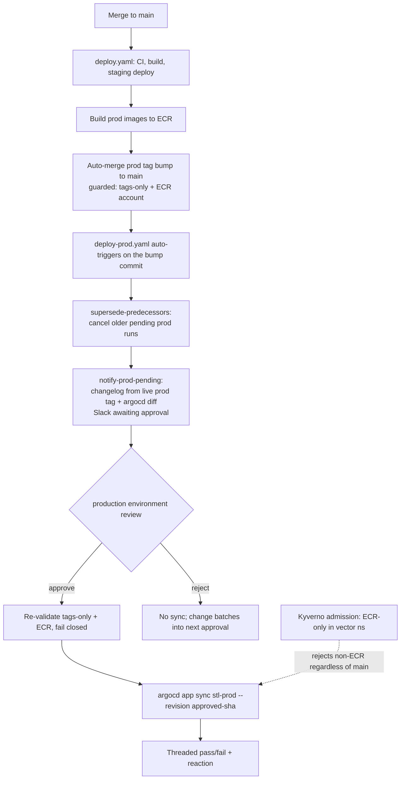

# ADR-0005: Prod Deploy via Auto-Merged Image Tags, GitHub Environment Gate, and CLI ArgoCD Sync

**Status**: Accepted
**Proposed**: @viallikavoo
**Date**: 2026-07-09
**Deciders**: @vector (agreed with @simon.bojeoutzen in #at_stl)

## Context

`stl` is a **public** repository whose deploy bot **auto-pushes to `main`**. Prod
runs on EKS under ArgoCD (`stl-prod`, `vector` namespace, account
`030797368798`). We needed prod image promotion to be automated yet safe, with a
human gate before rollout and defense-in-depth against a compromised bot or a
tampered `main`.

The previous model gated prod behind a **deploy PR** that a human merged. That
carried two problems:

1. A PR-per-deploy is slow and noisy, and diverges from staging (which already
   auto-merges tag bumps).
2. An earlier alternative, enabling ArgoCD **auto-sync** on `stl-prod`, would
   make `main` the deployed state by itself, removing the human gate and widening
   the blast radius of any write to `main`.

Both alternatives are rejected here in favour of the model below. The infra role
work (ORB-270), the stl workflow work (ORB-271), the Slack-token OIDC work
(ORB-268/269), and the cluster admission backstop (ORB-273, on Kyverno from
ORB-308) implement the pieces; this ADR is the decision record and security
model that ties them together.

## Decision

Prod image-tag bumps **auto-merge to `main`** (no PR, like staging), guarded by
automated checks. `stl-prod` stays **manual sync**, so `main` is never the
deployed state on its own. A `production` **GitHub Environment review** gates
rollout, and on approval a job syncs the exact reviewed revision via the ArgoCD
CLI.

1. **Auto-merge, guarded.** The bot commits the prod image-tag bump directly to
   `main`. The bump is admitted only if the diff is image tags only and every
   image resolves to our prod ECR account.
2. **Manual sync.** `stl-prod` has no ArgoCD `automated` sync. Rollout happens
   only through an approved `production` environment job.
3. **Environment gate.** The `production` GitHub Environment requires a reviewer.
   The pending-approval Slack message carries the changelog plus a collapsed
   `argocd app diff` so the reviewer approves what they see.
4. **Approve then sync.** On approve, a job in the `production` environment runs
   `argocd app sync stl-prod --revision <approved-sha>` through the shared
   `argocd-sync` action, then posts a threaded pass/fail and reaction. On reject,
   nothing syncs and the change batches into the next approved deploy.

### Refinement: prod rollout is its own auto-triggered workflow (ORB-306)

The gated sync job originally lived inline in the single CI/staging/prod
pipeline. Because GitHub cannot cancel an approval-waiting run via
`cancel-in-progress`, a pending prod approval held the run "in progress" and
blocked the next merge's CI and staging deploy (one run sat ~46h on the gate).

So prod rollout was split into a standalone `deploy-prod.yaml`, auto-triggered by
the prod-kustomization bump commit that the fast pipeline pushes to `main`. The
fast pipeline (CI, build, staging deploy, prod image build, prod tag bump)
finishes in minutes and releases the concurrency slot; the approval gate no
longer blocks staging. A `supersede-predecessors` job cancels older still-pending
prod runs so only the newest awaits approval (latest-wins), backed by a freshness
check as a second line of defense. Ordered main-commit serialization for tag
bumps is preserved (does not reopen ORB-293 / VEC-250).

### Refinement: changelog baseline is the live prod image tag (#523)

The pending-approval changelog is computed from `BASELINE..DEPLOY_SHA`. The
baseline is read from the **running prod image tag** (`.status.summary.images`),
not from `.status.sync.revision`. Because `stl-prod` tracks `main`/HEAD,
`sync.revision` advances to ~HEAD on every refresh and yields an empty range (it
shows only the deploy's own tag commit). The running image tag is the true "what
is in prod" and correctly batches any rejected deploys, since prod keeps the
last-approved tag until a sync is approved.

## Security model (why each control)

The repo is public and the bot writes to `main`, so no single layer is trusted
alone.

1. **Deploy capability bound to approval.** The argocd-sync OIDC role trusts only
   `repo:archon-research/stl:environment:production`, so the sync capability is
   unobtainable without a human approval. The ArgoCD token RBAC is scoped to
   `sync vector/stl-prod`. (ORB-270)
2. **Constrained auto-merge.** Image-tags-only and ECR-account provenance are
   re-validated fail-closed inside the gated sync job, not only at bump time; the
   reviewer sees the full diff. (ORB-271)
3. **Provenance backstop at the cluster.** A Kyverno admission policy rejects any
   non-ECR image in the `vector` namespace regardless of how it reached `main`,
   so it survives a compromised CI, bot, or `main`. Per-cluster allowlist: prod
   `030797368798.dkr.ecr.eu-west-1.amazonaws.com/stl-sentinelprod-*`, staging
   `579039992622.dkr.ecr.eu-west-1.amazonaws.com/stl-sentinelstaging-*`.
   (ORB-273, engine ORB-308)
4. **Approve what you see.** The job syncs the exact reviewed revision
   (`github.sha`). The changelog is anchored to the live prod tag so rejected
   changes stay visible and batch into the next approval. (ORB-271, #523)
5. **Public-repo and bot hygiene.** Minimal DEPLOY_APP permissions plus rotation
   (ORB-165), verified commits, no template injection in workflow expressions,
   and fork PRs cannot deploy. The Slack bot token is fetched from AWS Secrets
   Manager over OIDC rather than stored as a GitHub secret. (ORB-268/269)

## Consequences

Positive:

- Prod deploys are automated up to a single human gate; no deploy PR to merge.
- A pending approval never blocks CI or staging on `main`.
- The deploy capability cannot be exercised without a human approval, and a bad
  image is rejected at the cluster even if every CI check is bypassed.
- The reviewer sees an accurate changelog and diff for exactly what will go live.

Trade-offs:

- The gated changelog and diff logic now exists in both `deploy.yaml` (the jobs
  it retains) and `deploy-prod.yaml`; a shared composite action is a candidate if
  it drifts again.
- Latest-wins supersession means an older pending deploy is intentionally
  cancelled rather than queued.
- The changelog baseline degrades to a no-range message when `stl-prod` reports
  more than one distinct live image tag (mid-rollout or a pinned workload),
  rather than guessing a baseline.

## Non-Goals

- Enabling ArgoCD `automated` sync or self-heal on `stl-prod` (explicitly
  rejected; sync stays human-gated).
- A deploy-PR-per-rollout gate (replaced by the environment review).
- Cosign `verifyImages`, digest pinning, or promote-by-digest. These are
  hardening options layered on top of the ECR allowlist, tracked separately.

## Related work

- ORB-267 (parent epic), ORB-272 (this decision record)
- ORB-270 (infra: sync RBAC + env-scoped OIDC role, keep stl-prod manual)
- ORB-271 (stl: guarded auto-merge + env gate + argocd sync + threaded status)
- ORB-273 / ORB-308 (Kyverno ECR-only admission policy + engine)
- ORB-268 / ORB-269 (Slack bot token via OIDC self-fetch)
- ORB-306 (split prod into its own auto-triggered workflow)
- PR #523 (changelog baseline = live prod image tag)

## Flow

