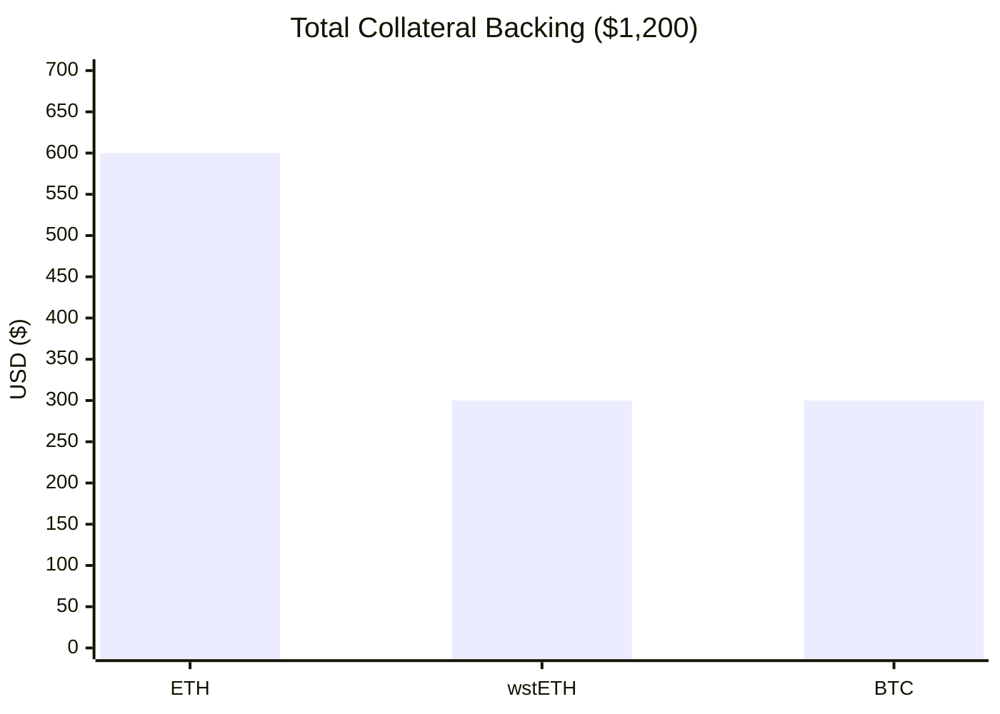
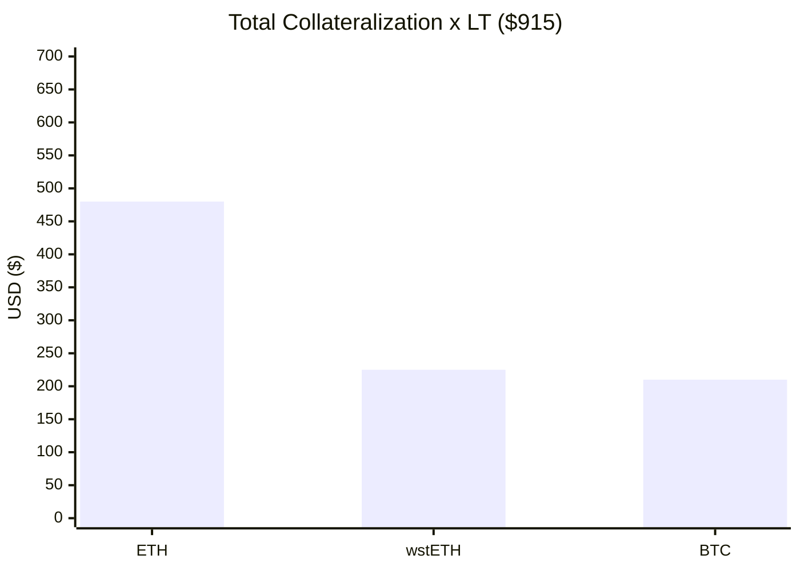
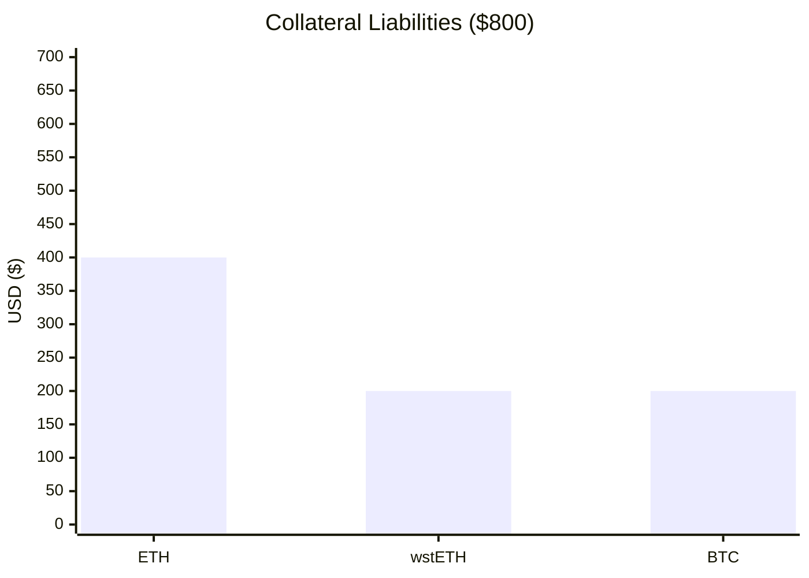
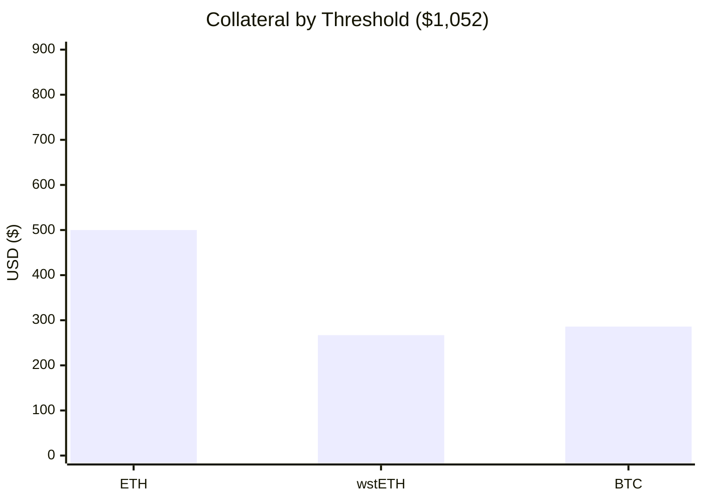

# Lending Position Backing Analysis

## Table of Contents

- [Problem Statement](#problem-statement)
- [Example Scenario](#example-scenario)

**Backing Views:**
1. [Total Collateral Backing](#1-total-collateral-backing)
2. [Total Collateralization × Liquidation Threshold](#2-total-collateralization--liquidation-threshold)
3. [Collateral Liabilities](#3-collateral-liabilities)
4. [Collateral by Threshold](#4-collateral-by-threshold)
5. [Including Available Liquidity](#5-including-available-liquidity)

**Reference:**
- [Comparison](#comparison)
- [Extensions](#extensions)
- [Appendix A: Why Total Collateral Backing Proportions Cannot Be Used for Collateral Liabilities](#appendix-a-why-total-collateral-backing-proportions-cannot-be-used-for-collateral-liabilities)
- [Appendix B: Backing Views on BA Labs' Dashboards](#appendix-b-backing-views-on-ba-labs-dashboards)

---

## Problem Statement

In a shared-lending protocol (Aave, SparkLend), lenders supply assets into a common pool. Borrowers draw from that pool by posting collateral. There is no direct lender–borrower relationship — capital is fungible within each pool.

A lender naturally wants to understand: **what collateral effectively backs my position?** If borrowers default, their collateral is liquidated to repay lenders, so the composition and adequacy of that collateral determines the lender's risk profile.

This document presents several complementary views of the backing picture for a supplied asset, along with derived metrics. All views use the same example scenario, with USDC as the supplied asset.

---

## Example Scenario

```
Market participants:
  Alice (lender)   — supplies 1,000 USDC

  Bob (borrower)   — collateral: $800 ETH  +  $400 wstETH  =  $1,200 total
                   — borrows:    600 USDC  +  200 DAI       =  $800 total debt
                   — health factor: 1.175

  Carol (borrower) — collateral: $300 BTC
                   — borrows:    200 USDC                    =  $200 total debt
                   — health factor: 1.05

Liquidation thresholds:
  ETH:    80%
  wstETH: 75%
  BTC:    70%

USDC market:
  Total supplied:  1,000 USDC
  Total borrowed:    800 USDC  (Bob: 600, Carol: 200)
```

**Question:** What does Alice's USDC backing look like, and how healthy is it?

---

## 1. Total Collateral Backing

**Question answered:** What is the USDC-attributed collateral of everyone who has borrowed USDC?

For each USDC borrower, their collateral is scaled by the fraction of their total debt that is USDC. A borrower who also holds non-USDC debts only contributes their USDC share of collateral, ensuring the collateral picture is correctly scoped to USDC.

**Steps:**
1. Find all USDC borrowers
2. For each borrower, compute their USDC allocation ratio = (their USDC debt) / (their total debt across all assets)
3. Multiply each of their collateral assets by this ratio
4. Sum across all borrowers

**Calculation:**

```
USDC-attributed collateral:

  Bob (USDC ratio: $600 / $800 = 75%):
    ETH:    $800 × 0.75  =  $600
    wstETH: $400 × 0.75  =  $300

  Carol (USDC ratio: $200 / $200 = 100%):
    BTC:    $300 × 1.00  =  $300

Aggregate:
  ETH      $600   (50.0%)
  wstETH   $300   (25.0%)
  BTC      $300   (25.0%)
  ─────────────────────
  Total  $1,200   (100%)
```

**Derived metrics:**

| Metric                       | Value  | Definition                                              |
|------------------------------|--------|---------------------------------------------------------|
| **Total Debt Collateralization** | $1,200 | Sum of USDC-attributed collateral across all USDC borrowers |
| **Total USDC Debt**             | $800   | Total USDC currently borrowed from the pool             |



---

## 2. Total Collateralization × Liquidation Threshold

**Question answered:** How much USDC-attributed borrowing capacity does the collateral support?

Each collateral asset has a **liquidation threshold (LT)** — the maximum fraction of its value that can be borrowed against. Multiplying each USDC-attributed collateral total by its LT gives the USDC-attributed borrowing capacity.

**Calculation:**

```
USDC-attributed Collateral × LT:
  ETH:    $600 × 0.80  =  $480   (52.5%)
  wstETH: $300 × 0.75  =  $225   (24.6%)
  BTC:    $300 × 0.70  =  $210   (23.0%)
  ──────────────────────────────
  Maximum Debt:           $915   (100%)
```

Since each borrower's collateral was scaled by their USDC debt fraction in Section 1, the Maximum Debt here represents only USDC-attributed borrowing capacity. Liquidation Buffer and Debt Utilization can therefore be computed directly against Total USDC Debt — both sides of the comparison are scoped to USDC.

| Metric                 | Value  | Definition                                              |
|------------------------|--------|---------------------------------------------------------|
| **Maximum Debt**       | $915   | USDC-attributed borrowing capacity: Σ(attributed collateral × LT) |
| **Liquidation Buffer** | $115   | Maximum Debt − Total USDC Debt                          |
| **Debt Utilization**   | 87.4%  | Total USDC Debt / Maximum Debt                          |



Debt Utilization indicates how much of the USDC-attributed borrowing capacity is consumed. At 87.4%, these borrowers are collectively close to their limits — a moderate price decline in any collateral asset could trigger liquidations.

---

## 3. Collateral Liabilities

**Question answered:** What is each USDC lender's proportional collateral exposure — the composition of collateral that "belongs to" USDC specifically?

The previous views attribute collateral to USDC using each borrower's debt ratio, which preserves the full overcollateralization. Collateral Liabilities narrows further to the USDC lender's **fair share** by capping each borrower's contribution at their USDC debt amount, distributed across their collateral composition.

**Core idea:** Each USDC borrower contributes to the backing profile in proportion to their share of total USDC debt. Their full collateral composition is used as-is — whether or not they also hold other debts.

**Steps:**
1. Find all USDC borrowers
2. For each borrower, compute weight = (their USDC debt) / (total USDC debt)
3. Multiply each borrower's collateral composition by their weight
4. Sum across all borrowers

**Calculation:**

```
Total USDC borrowed: $800

Bob — weight: $600 / $800 = 75%
  Collateral composition: 66.67% ETH, 33.33% wstETH
  Contribution:  75% × 66.67% ETH     =  50.00% ETH
                 75% × 33.33% wstETH  =  25.00% wstETH

Carol — weight: $200 / $800 = 25%
  Collateral composition: 100% BTC
  Contribution:  25% × 100% BTC  =  25.00% BTC
```

**Result:**

| Collateral | Backing % | USD   |
|------------|-----------|-------|
| ETH        | **50.0%** | $400  |
| wstETH     | **25.0%** | $200  |
| BTC        | **25.0%** | $200  |
| **Total**  | **100%**  | **$800** |

**Key property:** The dollar total of Collateral Liabilities always equals Total USDC Debt. This is because each borrower contributes exactly their USDC debt amount, distributed across their collateral proportionally.



---

## 4. Collateral by Threshold

**Question answered:** Adjusting for each asset's capital efficiency, how much collateral of each type is required to sustain the USDC liabilities at the liquidation boundary?

Collateral Liabilities tells you the USDC-attributed dollar amount per collateral type, but treats all collateral dollars equally. In practice, assets with lower liquidation thresholds require more collateral per dollar of debt they support. Dividing each Collateral Liability by its asset's LT gives the **threshold-equivalent collateral** — the minimum collateral of each type needed to sustain those liabilities right at the liquidation boundary.

**Calculation:**

```
Collateral Liabilities ÷ LT:
  ETH:    $400 / 0.80  =  $500.00   (47.5%)
  wstETH: $200 / 0.75  =  $266.67   (25.3%)
  BTC:    $200 / 0.70  =  $285.71   (27.2%)
  ──────────────────────────────────
  Total:                 $1,052.38   (100%)
```

Compared to Collateral Liabilities (50% / 25% / 25%), BTC's share increases from 25.0% to 27.2% because its lower LT (70% vs ETH's 80%) means more BTC collateral is needed per dollar of debt. The total ($1,052) represents the minimum aggregate collateral required to support $800 of USDC debt at the current liability composition and liquidation thresholds.



---

## 5. Including Available Liquidity

Not all supplied USDC is borrowed. The difference — **Available Liquidity** — remains in the pool and is immediately withdrawable. In the example: $1,000 supplied − $800 borrowed = **$200 USDC** idle in the pool.

Any of the four collateral views above can be extended by adding Available Liquidity as a USDC component. For example, Collateral Liabilities + Available Liquidity:

```
  USDC     $200   (20.0%)   ← available liquidity
  ETH      $400   (40.0%)
  wstETH   $200   (20.0%)
  BTC      $200   (20.0%)
  ─────────────────────
  Total  $1,000   (100%)
```

**Key property:** Collateral Liabilities + Available Liquidity = Total USDC Supply ($800 + $200 = $1,000). The total supply is split between what has been lent out (backed by borrower collateral) and what sits idle (backed by itself).

**Note:** Including available liquidity is useful for analytics dashboards that want to show the complete composition of what supports a lender's position. However, available liquidity is not collateral securing a borrow — it is native asset reserves. It should not be treated equivalently to the collateral components in risk simulations or liquidation analysis, where only actual borrower collateral is relevant.

---

## Comparison

The eight backing views, with and without available liquidity. See [Appendix B](#appendix-b-backing-views-on-ba-labs-dashboards) for where these views are used on BA Labs' dashboards.

| # | View | USDC | ETH | wstETH | BTC | Total |
|---|------|------|-----|--------|-----|-------|
| 1 | **Total Collateral Backing** | — | $600 (50.0%) | $300 (25.0%) | $300 (25.0%) | **$1,200** |
| 2 | **Total Collateral Backing + Liquidity** | $200 (14.3%) | $600 (42.9%) | $300 (21.4%) | $300 (21.4%) | **$1,400** |
| 3 | **Collateral by Threshold** | — | $500 (47.5%) | $267 (25.3%) | $286 (27.2%) | **$1,052** |
| 4 | **Collateral by Threshold + Liquidity** | $200 (16.0%) | $500 (39.9%) | $267 (21.3%) | $286 (22.8%) | **$1,252** |
| 5 | **Collateralization × LT** | — | $480 (52.5%) | $225 (24.6%) | $210 (23.0%) | **$915** |
| 6 | **Collateralization × LT + Liquidity** | $200 (17.9%) | $480 (43.0%) | $225 (20.2%) | $210 (18.8%) | **$1,115** |
| 7 | **Collateral Liabilities** | — | $400 (50.0%) | $200 (25.0%) | $200 (25.0%) | **$800** |
| 8 | **Collateral Liabilities + Liquidity** | $200 (20.0%) | $400 (40.0%) | $200 (20.0%) | $200 (20.0%) | **$1,000** |

```mermaid
xychart-beta
    title "Collateral Breakdown by Asset (excluding available liquidity)"
    x-axis ["ETH", "wstETH", "BTC"]
    y-axis "USD ($)" 0 --> 700
    bar [600, 300, 300]
    bar [500, 267, 286]
    bar [480, 225, 210]
    bar [400, 200, 200]
```



*Bars from top to bottom: View #1 (Total Collateral Backing), View #3 (Collateral by Threshold), View #5 (Collateralization × LT), View #7 (Collateral Liabilities)*

---

## Extensions

All metrics in Sections 1–5 are **compositional snapshots**: they answer "what collateral backs USDC?" but not "how likely is a loss, and how large?" The following extensions outline how to move from composition toward quantitative risk assessment.

### Limitations of the Base Methodology

- **Competing claims on collateral.** Multi-debt borrowers' collateral is contested — liquidators call `liquidationCall(collateralAsset, debtAsset, user, amount)` and choose the most profitable debt to repay first. USDC lenders are effectively pari passu with other creditors for the same collateral pool.
- **No risk weighting.** Standard Collateral Liabilities weights borrowers purely by debt share. A borrower at HF 1.05 with volatile collateral and one at HF 3.0 with stablecoins contribute equally per dollar of debt, despite orders-of-magnitude difference in liquidation probability.
- **Composition ≠ adequacy.** The breakdown shows *what* you're exposed to, not *how much buffer* you have. Two identical compositions at 1.1× vs 5× overcollateralization carry very different risk. This is why the metrics in Section 2 (Liquidation Buffer, Debt Utilization) are important complements.
- **Point-in-time only.** All metrics are instantaneous. A buffer that looks comfortable over 1 hour may be dangerous over 1 week, depending on collateral volatility.

### Extension 1: Default-Probability Risk Weighting

Replace the debt-share weighting in Collateral Liabilities with a probability-of-default weighting derived from the **Merton structural credit model**. For each borrower *j*, compute the Distance-to-Default:

```
DD_j = [ln(HF_j) + (μ_j − 0.5·σ_j²)·Δt] / (σ_j · √Δt)
PD_j = Φ(−DD_j)
weight_j = (d_j · PD_j) / Σ_k(d_k · PD_k)
```

- `σ_j` is the portfolio volatility of borrower *j*'s collateral basket, computed from the variance-covariance matrix of collateral assets using the Markowitz formula. Estimation should use GARCH(1,1) or EWMA rather than simple historical standard deviation, to capture volatility clustering.
- `μ_j` is the drift of collateral value relative to debt (collateral yield minus borrow APR). Negligible for short horizons at moderate rates, but material when borrow APRs spike above 50%.
- A naïve `1/HF` weighting is volatility-blind — it assigns identical risk to a borrower with stablecoin collateral and one with a volatile governance token at the same HF. The DD formulation naturally handles this: volatility appears in the denominator, so high-σ assets produce lower DD and higher PD for the same HF.

### Extension 2: Volatility-Adjusted Stress Metrics

Replace the static Liquidation Threshold haircut with a **volatility-adjusted value** at a given confidence level and time horizon:

```
Adjusted_Value_i = Collateral_i × (1 − m_α × σ_i × √Δt)
```

- The risk multiplier `m_α` should account for crypto's fat tails. Standard Gaussian VaR (`m = 2.326` at 99%) understates tail risk; Cornish-Fisher VaR (`m ≈ 3.5`, adjusting for typical crypto skew and kurtosis) or Student-t Expected Shortfall are more appropriate.
- Applying LT to volatility-adjusted values produces a **Stress Liquidation Buffer** that shows how much margin survives a given adverse scenario. Multi-day projections (using `√Δt` scaling or GARCH conditional volatility) reveal how quickly buffers erode.
- Collateral correlation matters: BTC-ETH correlation exceeds 0.85 during stress, so a portfolio "diversified" across major crypto assets provides far less diversification benefit than the compositional percentages suggest.

### Extension 3: Slippage-Adjusted Backing

Sections 1–4 implicitly assume collateral can be liquidated at oracle value. In practice, liquidations execute on-chain via DEX AMMs and suffer slippage that increases non-linearly with trade size relative to pool depth.

- For constant-product AMMs: `slippage ≈ Δx / (R + Δx)`. Concentrated liquidity pools (Uniswap V3) exhibit piecewise slippage — low within the active tick range, then catastrophic if the price gaps beyond it.
- Individual moderate-size liquidations typically produce negligible slippage. Risk materializes in **cascade scenarios** where aggregate liquidation volume across many borrowers overwhelms available pool depth.
- LP withdrawal during volatility spikes creates procyclical feedback: pool depth shrinks precisely when liquidation volume expands. A dynamic model (`R_stress = R_normal × e^(−λ × σ)`) captures this.
- Apply slippage haircuts to derive `Realizable_Value_i = Collateral_i × (1 − slippage_i)`, then recompute buffer metrics. The gap between oracle-value and realizable-value buffers is the **implicit slippage risk** hidden in the static view.

### Extension 4: Worst-Case Collateral Composition

Rather than dismissing the pari passu problem as unfixable, model the worst case for USDC lenders under rational liquidator behavior.

- Assume non-USDC debts are liquidated first, with liquidators consuming the highest-quality collateral (most liquid, highest liquidation bonus) under Aave's close-factor constraint.
- Compute the **residual collateral composition** remaining for USDC claims after adverse-selection liquidations. This produces a stress-scenario composition where high-quality collateral share decreases and lower-quality collateral share increases.
- Game-theoretic models confirm that rational liquidator behavior systematically degrades residual collateral quality for remaining claimants.
- Present alongside base-case Collateral Liabilities. Aave V4's Hub-and-Spoke architecture structurally eliminates this problem by isolating collateral pools.

### Extension 5: Expected Loss Framework

The bottom-line metric that combines all preceding risk dimensions into a single dollar estimate:

```
EL = Σ_j (PD_j × EAD_j × LGD_j)
```

- **PD** from the DD model (Extension 1).
- **EAD** (exposure at default) = current USDC debt, adjusted for interest accrual. At moderate utilization, compounding is negligible over short horizons. In high-utilization environments (50%+ APR from Aave's kinked rate curve), debt growth becomes material and actively erodes HF.
- **LGD** (loss given default) = `1 − recovery rate`, incorporating: overcollateralization margin (`1/weighted_LT`), slippage haircut (Extension 3), liquidation bonus, and adverse selection (Extension 4). LGD is typically zero for well-collateralized positions — slippage + bonus must exceed the overcollateralization margin before any loss reaches lenders.
- Per-lender EL is attributed proportionally to their share of total supply. This enables comparison across pools/protocols, yield-vs-risk evaluation, and position sizing.

---

## Appendix A: Why Total Collateral Backing Proportions Cannot Be Used for Collateral Liabilities

It may be tempting to derive Collateral Liabilities by simply taking the percentage breakdown from Total Collateral Backing — that is, using the same debt-split scaling from Section 1 and treating the resulting proportions as the liability composition.

**Steps (same as Total Collateral Backing, Section 1):**
1. Find all USDC borrowers
2. For each borrower:
   - Compute allocation ratio = (their USDC debt) / (their total debt across all assets)
   - Multiply each of their collateral assets by this ratio
3. Sum the attributed collateral across all borrowers
4. Normalize to percentages

These steps are correct for computing Total Collateral Backing and its derived aggregate metrics (Debt Collateralization, Maximum Debt, Liquidation Buffer). However, the **proportions** produced by step 4 do not give Collateral Liabilities, because the attributed collateral amount per borrower scales with **collateral size**, not with **debt size**. For a single-asset borrower, the attribution is `(USDC_debt / total_debt) × total_collateral`. When a borrower has only USDC debt, this simplifies to their **entire collateral** regardless of how little they actually borrowed.

This means a massively overcollateralized borrower with a trivial USDC position can dominate the composition, even though their position poses negligible risk.

**Demonstration using the example scenario + one new borrower:**

```
Add Dave: collateral $1,000,000,000 LINK, borrows $1 USDC

Total Collateral Backing (debt-split):
  Bob:   ratio = $600 / $800 = 75%
         ETH:    75% × $800    =  $600
         wstETH: 75% × $400    =  $300

  Carol: ratio = $200 / $200 = 100%
         BTC:    100% × $300   =  $300

  Dave:  ratio = $1 / $1 = 100%
         LINK:   100% × $1,000,000,000  =  $1,000,000,000

Total attributed: $1,000,001,200

Proportions (step 4):
  ETH      $600             ≈  0.00006%
  wstETH   $300             ≈  0.00003%
  BTC      $300             ≈  0.00003%
  LINK     $1,000,000,000   ≈  99.99988%
```

If these proportions were used as Collateral Liabilities, a borrower who took **$1 of USDC** — a position that could create at most $1 of bad debt — would rewrite Alice's entire backing profile to 99.999% LINK. This does not reflect liquidation risk exposure in any meaningful sense.

Note that the Total Collateral Backing **aggregate metrics** remain correct: Dave legitimately adds ~$1B to Debt Collateralization and ~$1B × LT to Maximum Debt, reflecting that the USDC pool is extremely well-collateralized. The issue is specifically with using the proportions as a composition measure of risk exposure.

Collateral Liabilities avoids this by weighting each borrower by their share of **total USDC debt** and using their collateral composition. This keeps each borrower's influence proportional to the loss they could actually inflict on USDC lenders: Dave's $1 of USDC debt gives him a negligible weight regardless of his collateral size.

---

## Appendix B: Backing Views on BA Labs' Dashboards

### spark.blockanalitica.com — Markets Page (Debt Tab)

On the **Markets → Debt** tab (e.g., [wstETH debt analysis](https://spark.blockanalitica.com/v1/ethereum/markets/wstETH/debt)), the following charts and metrics correspond to views from this document:

| Dashboard Element | Backing View | Description |
|-------------------|--------------|-------------|
| **Collateralization** chart | View **#1** | Total Collateral Backing |
| **Historical Collateralization** chart | View **#5** | Collateralization × LT |
| **Collateral Liabilities** chart | View **#7** | Collateral Liabilities |
| **Debt collateralization** metric | — | Total Debt Collateralization |
| **Total debt** metric | — | Total Debt |
| **Liquidation Buffer** metric | — | Maximum Debt − Total Debt |
| **Debt Utilization** metric | — | Total Debt / Maximum Debt |

### data.spark.fi — Backed Breakdown (Allocation View)

On the **Backed Breakdown** page for DeFi lending allocations, the chart options correspond to different views depending on whether the asset is considered to have "idle assets":

**For assets without idle assets** (e.g., [spPYUSD](https://data.spark.fi/spark-liquidity-layer/assets/0x779224df1c756b4edd899854f32a53e8c2b2ce5d?wallet_address=0x1601843c5e9bc251a3272907010afa41fa18347e&network=ethereum)):

| Chart Option | Backing View |
|--------------|--------------|
| **Full Collateral** | View **#2** (Total Collateral Backing + Liquidity) |
| **Backed by Threshold** | View **#4** (Collateral by Threshold + Liquidity) |
| **Backed by Allocation** | View **#8** (Collateral Liabilities + Liquidity) |

**For assets with idle assets** (e.g., [spUSDS](https://data.spark.fi/spark-liquidity-layer/assets/0xc02ab1a5eaa8d1b114ef786d9bde108cd4364359?wallet_address=0x1601843c5e9bc251a3272907010afa41fa18347e&network=ethereum)):

| Chart Option | Backing View | Note |
|--------------|--------------|------|
| **Full Collateral** | View **#1** (Total Collateral Backing) | Scaled by allocation proportion of total supply to pool |
| **Backed by Threshold** | View **#3** (Collateral by Threshold) | Scaled by allocation proportion of total supply to pool |
| **Backed by Allocation** | View **#7** (Collateral Liabilities) | Scaled by allocation proportion of total supply to pool |
