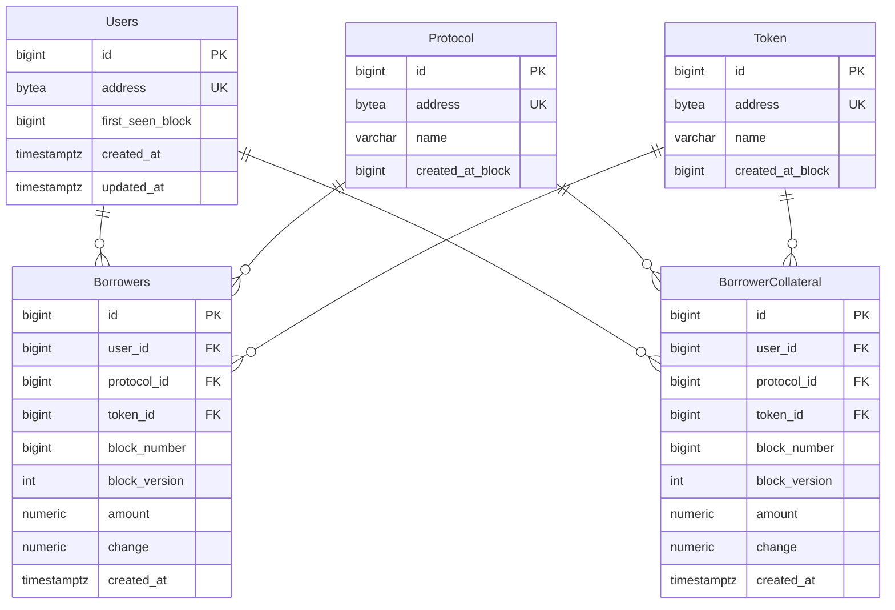

```mermaid
erDiagram
    Token {
        bigint id PK
        bytea address UK
        varchar name
        bigint created_at_block
    }

    Protocol {
        bigint id PK
        bytea address UK
        varchar name
        bigint created_at_block
    }

    Users {
        bigint id PK
        bytea address UK
        bigint first_seen_block
        timestamptz created_at
        timestamptz updated_at
    }

    Borrowers {
        bigint id PK
        bigint user_id FK
        bigint protocol_id FK
        bigint token_id FK
        bigint block_number
        int block_version
        numeric amount
        numeric change
        timestamptz created_at
    }

    BorrowerCollateral {
        bigint id PK
        bigint user_id FK
        bigint protocol_id FK
        bigint token_id FK
        bigint block_number
        int block_version
        numeric amount
        numeric change
        timestamptz created_at
    }

    Users ||--o{ Borrowers : ""
    Users ||--o{ BorrowerCollateral : ""
    Protocol ||--o{ Borrowers : ""
    Protocol ||--o{ BorrowerCollateral : ""
    Token ||--o{ Borrowers : ""
    Token ||--o{ BorrowerCollateral : ""
```