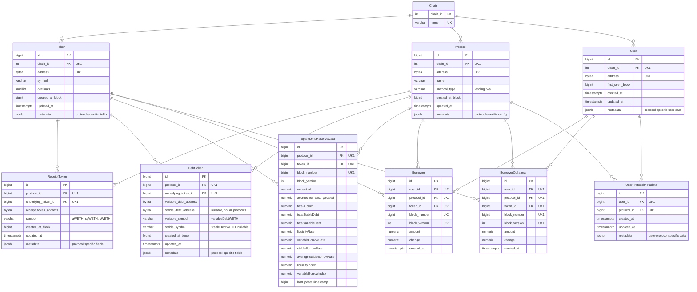

```mermaid
erDiagram
    Chain {
        int chain_id PK
        varchar name UK
    }

    Token {
        bigint id PK
        int chain_id FK "UK1"
        bytea address "UK1"
        varchar symbol
        smallint decimals
        bigint created_at_block
        timestamptz updated_at
        jsonb metadata "protocol-specific fields"
    }

    Protocol {
        bigint id PK
        int chain_id FK "UK1"
        bytea address "UK1"
        varchar name
        varchar protocol_type "lending,rwa"
        bigint created_at_block
        timestamptz updated_at
        jsonb metadata "protocol-specific config"
    }

    ReceiptToken {
        bigint id PK
        bigint protocol_id FK "UK1"
        bigint underlying_token_id FK "UK1"
        bytea receipt_token_address
        varchar symbol "aWETH, spWETH, cWETH"
        bigint created_at_block
        timestamptz updated_at
        jsonb metadata "protocol-specific fields"
    }

    DebtToken {
        bigint id PK
        bigint protocol_id FK "UK1"
        bigint underlying_token_id FK "UK1"
        bytea variable_debt_address
        bytea stable_debt_address "nullable, not all protocols"
        varchar variable_symbol "variableDebtWETH"
        varchar stable_symbol "stableDebtWETH, nullable"
        bigint created_at_block
        timestamptz updated_at
        jsonb metadata "protocol-specific fields"
    }

    User {
        bigint id PK
        int chain_id FK "UK1"
        bytea address "UK1"
        bigint first_seen_block
        timestamptz created_at
        timestamptz updated_at
        jsonb metadata "protocol-specific user data"
    }

    SparkLendReserveData {
        bigint id PK
        bigint protocol_id FK "UK1"
        bigint token_id FK "UK1"
        bigint block_number "UK1"
        int block_version
        numeric unbacked
        numeric accruedToTreasuryScaled
        numeric totalAToken
        numeric totalStableDebt
        numeric totalVariableDebt
        numeric liquidityRate
        numeric variableBorrowRate
        numeric stableBorrowRate
        numeric averageStableBorrowRate
        numeric liquidityIndex
        numeric variableBorrowIndex
        bigint lastUpdateTimestamp
    }

    Borrower {
        bigint id PK
        bigint user_id FK "UK1"
        bigint protocol_id FK "UK1"
        bigint token_id FK "UK1"
        bigint block_number "UK1"
        int block_version "UK1"
        numeric amount
        numeric change
        timestamptz created_at
    }

    BorrowerCollateral {
        bigint id PK
        bigint user_id FK "UK1"
        bigint protocol_id FK "UK1"
        bigint token_id FK "UK1"
        bigint block_number "UK1"
        int block_version "UK1"
        numeric amount
        numeric change
        timestamptz created_at
    }

    UserProtocolMetadata {
        bigint id PK
        bigint user_id FK "UK1"
        bigint protocol_id FK "UK1"
        timestamptz created_at
        timestamptz updated_at
        jsonb metadata "user-protocol specific data"
    }

    Chain ||--o{ Token : ""
    Chain ||--o{ Protocol : ""
    Chain ||--o{ User : ""
    Protocol ||--o{ ReceiptToken : ""
    Protocol ||--o{ DebtToken : ""
    Protocol ||--o{ SparkLendReserveData : ""
    Token ||--o{ ReceiptToken : ""
    Token ||--o{ DebtToken : ""
    Token ||--o{ SparkLendReserveData : ""
    User ||--o{ Borrower : ""
    User ||--o{ BorrowerCollateral : ""
    Protocol ||--o{ Borrower : ""
    Protocol ||--o{ BorrowerCollateral : ""
    Token ||--o{ Borrower : ""
    Token ||--o{ BorrowerCollateral : ""
    User ||--o{ UserProtocolMetadata : ""
    Protocol ||--o{ UserProtocolMetadata : ""
```