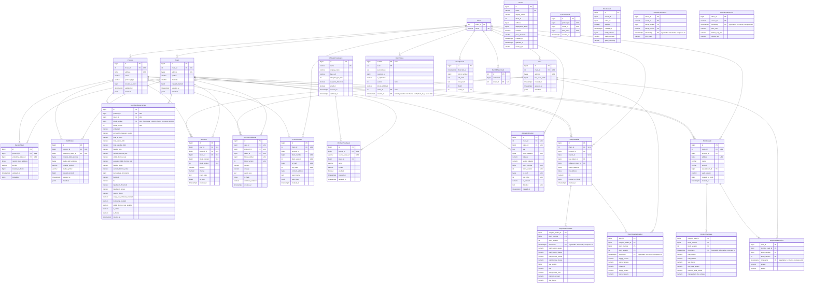

```mermaid
erDiagram
    Chain {
        int chain_id PK
        varchar name "UK"
    }

    Token {
        bigint id PK
        int chain_id FK "UK1"
        bytea address "UK1"
        varchar symbol
        smallint decimals
        bigint created_at_block
        timestamptz updated_at
        jsonb metadata
    }

    Protocol {
        bigint id PK
        int chain_id FK "UK1"
        bytea address "UK1"
        varchar name
        varchar protocol_type
        bigint created_at_block
        timestamptz updated_at
        jsonb metadata
    }

    User {
        bigint id PK
        int chain_id FK "UK1"
        bytea address "UK1"
        bigint first_seen_block
        timestamptz created_at
        timestamptz updated_at
        jsonb metadata
    }

    ReceiptToken {
        bigint id PK
        bigint protocol_id FK "UK1"
        bigint underlying_token_id FK "UK1"
        bytea receipt_token_address
        varchar symbol
        bigint created_at_block
        timestamptz updated_at
        jsonb metadata
    }

    DebtToken {
        bigint id PK
        bigint protocol_id FK "UK1"
        bigint underlying_token_id FK "UK1"
        bytea variable_debt_address
        bytea stable_debt_address
        varchar variable_symbol
        varchar stable_symbol
        bigint created_at_block
        timestamptz updated_at
        jsonb metadata
    }

    SparklendReserveData {
        bigint id PK
        bigint protocol_id FK "UK1"
        bigint token_id FK "UK1"
        bigint block_number PK "UK1, hypertable: 100000 chunks, compress 100000"
        int block_version "UK1"
        numeric unbacked
        numeric accrued_to_treasury_scaled
        numeric total_a_token
        numeric total_stable_debt
        numeric total_variable_debt
        numeric liquidity_rate
        numeric variable_borrow_rate
        numeric stable_borrow_rate
        numeric average_stable_borrow_rate
        numeric liquidity_index
        numeric variable_borrow_index
        bigint last_update_timestamp
        numeric decimals
        numeric ltv
        numeric liquidation_threshold
        numeric liquidation_bonus
        numeric reserve_factor
        boolean usage_as_collateral_enabled
        boolean borrowing_enabled
        boolean stable_borrow_rate_enabled
        boolean is_active
        boolean is_frozen
        timestamptz created_at
    }

    Borrower {
        bigint id PK
        bigint user_id FK "UK1"
        bigint protocol_id FK "UK1"
        bigint token_id FK "UK1"
        bigint block_number "UK1"
        int block_version "UK1"
        numeric amount
        numeric change
        text event_type
        bytea tx_hash
        timestamptz created_at
    }

    BorrowerCollateral {
        bigint id PK
        bigint user_id FK "UK1"
        bigint protocol_id FK "UK1"
        bigint token_id FK "UK1"
        bigint block_number "UK1"
        int block_version "UK1"
        numeric amount
        numeric change
        text event_type
        bytea tx_hash
        boolean collateral_enabled
        timestamptz created_at
    }

    ProtocolEvent {
        bigint id PK
        int chain_id FK "UK1"
        bigint protocol_id FK
        bigint block_number "UK1"
        int block_version "UK1"
        bytea tx_hash "UK1"
        int log_index "UK1"
        bytea contract_address
        text event_name
        jsonb event_data
        timestamptz created_at
    }

    Oracle {
        bigint id PK
        varchar name "UK"
        varchar display_name
        int chain_id
        bytea address
        bigint deployment_block
        boolean enabled
        smallint price_decimals
        timestamptz created_at
        timestamptz updated_at
        varchar oracle_type
    }

    ProtocolOracle {
        bigint id PK
        bigint protocol_id "UK1"
        bigint oracle_id "UK1"
        bigint from_block "UK1"
        timestamptz created_at
    }

    OracleAsset {
        bigint id PK
        bigint oracle_id
        bigint token_id
        boolean enabled
        timestamptz created_at
        bytea feed_address
        smallint feed_decimals
        varchar quote_currency
    }

    OffchainPriceSource {
        bigint id PK
        varchar name "UK"
        varchar display_name
        varchar base_url
        int rate_limit_per_min
        boolean supports_historical
        boolean enabled
        timestamptz created_at
        timestamptz updated_at
    }

    OffchainPriceAsset {
        bigint id PK
        bigint source_id FK "UK1"
        varchar source_asset_id "UK1"
        bigint token_id FK
        varchar name
        varchar symbol
        boolean enabled
        timestamptz created_at
        timestamptz updated_at
    }

    OnchainTokenPrice {
        bigint token_id PK
        smallint oracle_id PK
        bigint block_number PK
        smallint block_version PK
        timestamptz timestamp PK "hypertable: 1d chunks, compress 1d"
        numeric price_usd
    }

    OffchainTokenPrice {
        bigint token_id PK
        smallint source_id PK
        timestamptz timestamp PK "hypertable: 1d chunks, compress 1d"
        numeric price_usd
        numeric market_cap_usd
        numeric volume_usd
    }

    BlockStates {
        bigint number PK "UK1"
        text hash PK
        text parent_hash
        bigint received_at
        boolean is_orphaned
        int version "UK1"
        boolean block_published
        int chain_id PK "UK1"
        timestamptz created_at PK "UK1, hypertable: 1d chunks, hash(chain_id,4), retain 30d"
    }

    ReorgEvents {
        bigint id PK
        timestamptz detected_at
        bigint block_number
        text old_hash
        text new_hash
        int depth
        int chain_id FK
    }

    BackfillWatermark {
        int id PK
        bigint watermark
        int chain_id FK "UK"
    }

    AllocationPosition {
        bigint id PK
        int chain_id FK "UK1"
        bigint token_id FK "UK1"
        text star
        bytea proxy_address "UK1"
        numeric balance
        numeric scaled_balance
        bigint block_number "UK1"
        int block_version "UK1"
        bytea tx_hash "UK1"
        int log_index "UK1"
        numeric tx_amount
        text direction "UK1"
        timestamptz created_at
    }

    MorphoMarket {
        bigint id PK
        int chain_id FK "UK1"
        bigint protocol_id FK
        bytea market_id "UK1"
        bigint loan_token_id FK
        bigint collateral_token_id FK
        bytea oracle_address
        bytea irm_address
        numeric lltv
        bigint created_at_block
        timestamptz created_at
    }

    MorphoMarketPosition {
        bigint user_id PK
        bigint morpho_market_id PK
        bigint block_number PK
        int block_version PK
        timestamptz timestamp PK "hypertable: 1d chunks, compress 1d"
        numeric supply_shares
        numeric borrow_shares
        numeric collateral
        numeric supply_assets
        numeric borrow_assets
    }

    MorphoMarketState {
        bigint morpho_market_id PK
        bigint block_number PK
        int block_version PK
        timestamptz timestamp PK "hypertable: 1d chunks, compress 1d"
        numeric total_supply_assets
        numeric total_supply_shares
        numeric total_borrow_assets
        numeric total_borrow_shares
        bigint last_update
        numeric fee
        numeric prev_borrow_rate
        numeric interest_accrued
        numeric fee_shares
    }

    MorphoVault {
        bigint id PK
        int chain_id FK "UK1"
        bigint protocol_id FK
        bytea address "UK1"
        varchar name
        varchar symbol
        bigint asset_token_id FK
        smallint vault_version
        bigint created_at_block
        timestamptz created_at
    }

    MorphoVaultPosition {
        bigint user_id PK
        bigint morpho_vault_id PK
        bigint block_number PK
        int block_version PK
        timestamptz timestamp PK "hypertable: 1d chunks, compress 1d"
        numeric shares
        numeric assets
    }

    MorphoVaultState {
        bigint morpho_vault_id PK
        bigint block_number PK
        int block_version PK
        timestamptz timestamp PK "hypertable: 1d chunks, compress 1d"
        numeric total_assets
        numeric total_shares
        numeric fee_shares
        numeric new_total_assets
        numeric previous_total_assets
        numeric management_fee_shares
    }

    Chain ||--o{ Token : ""
    Chain ||--o{ Protocol : ""
    Chain ||--o{ User : ""
    Chain ||--o{ ProtocolEvent : ""
    Chain ||--o{ BlockStates : ""
    Chain ||--o{ ReorgEvents : ""
    Chain ||--o{ BackfillWatermark : ""
    Chain ||--o{ AllocationPosition : ""
    Chain ||--o{ MorphoMarket : ""
    Chain ||--o{ MorphoVault : ""
    Token ||--o{ ReceiptToken : ""
    Token ||--o{ DebtToken : ""
    Token ||--o{ SparklendReserveData : ""
    Token ||--o{ Borrower : ""
    Token ||--o{ BorrowerCollateral : ""
    Token ||--o{ OffchainPriceAsset : ""
    Token ||--o{ AllocationPosition : ""
    Token ||--o{ MorphoMarket : ""
    Token ||--o{ MorphoVault : ""
    Protocol ||--o{ ReceiptToken : ""
    Protocol ||--o{ DebtToken : ""
    Protocol ||--o{ SparklendReserveData : ""
    Protocol ||--o{ Borrower : ""
    Protocol ||--o{ BorrowerCollateral : ""
    Protocol ||--o{ ProtocolEvent : ""
    Protocol ||--o{ MorphoMarket : ""
    Protocol ||--o{ MorphoVault : ""
    User ||--o{ Borrower : ""
    User ||--o{ BorrowerCollateral : ""
    User ||--o{ MorphoMarketPosition : ""
    User ||--o{ MorphoVaultPosition : ""
    OffchainPriceSource ||--o{ OffchainPriceAsset : ""
    MorphoMarket ||--o{ MorphoMarketPosition : ""
    MorphoMarket ||--o{ MorphoMarketState : ""
    MorphoVault ||--o{ MorphoVaultPosition : ""
    MorphoVault ||--o{ MorphoVaultState : ""
```
