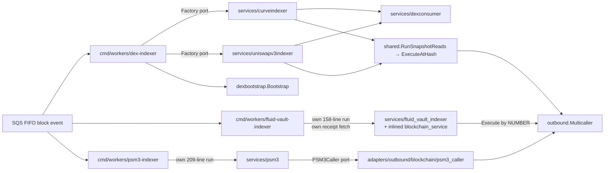

Status: FINAL

# 03 — DEX / AMM / vault / orderbook indexers

Verified against `main` @ `c4e0a8f2`. `go build ./...` and `go vet` over every package in this
area are clean.

## 1. Area map

Two families live here, and they are architecturally unrelated.

**On-chain family** — SQS block-event consumers that read pool/vault state at a block and append
snapshot rows. Four of them, with three different degrees of sharing:



`dex-indexer` is the good end of the spectrum: one binary, a `Factory` port (`factories.go:21-28`)
with two real adapters, `dexbootstrap.Bootstrap` for wiring, `dexconsumer` for the
receipt-fetch/due-set/persist skeleton, `shared.RunSnapshotReads` for hash-pinned multicall reads,
`dextelemetry` for metrics. `fluid-vault-indexer` and `psm3-indexer` re-implement almost all of
that per binary.

**CEX family** — `adapters/outbound/orderbook` (WebSocket L2 books for OKX/Kraken/Coinbase, behind
`exchangeFeed` + `outbound.OrderbookProvider`) → `services/cex_orderbook_indexer` (tick-based
top-N snapshot persist) → `cmd/workers/cex-orderbook-indexer`. No block events, no multicall.
This family is the best-factored code in the area and shares nothing with the on-chain family
(correctly).

Also here: `internal/pkg/uniswapv3` — which despite the name is **not** used by
`uniswapv3indexer`; its only consumer is `allocation_tracker` (F03.8).

## 2. Metrics

| Package | Src lines | Test lines | Ratio | Ports consumed | Test doubles |
|---|---|---|---|---|---|
| `services/curveindexer` | 3630 | 4387 | 1.21 | 4 (+6 DTOs) | 6 |
| `services/uniswapv3indexer` | 1637 | 4554 | 2.78 | 4 | 5 |
| `services/fluid_vault_indexer` | 1017 | 1912 | 1.88 | 8 | 9 |
| `services/psm3` | 376 | 963 | 2.56 | 4 | 4 |
| `services/dexconsumer` | 515 | 998 | 1.94 | 8 | 6 |
| `services/cex_orderbook_indexer` | 310 | 526 | 1.70 | 2 | 2 |
| `adapters/outbound/orderbook` | 1791 | 2679 | 1.50 | 1 (implements) | 2 |
| `pkg/uniswapv3` | 613 | 533 | 0.87 | 1 | 0 |
| `pkg/dextelemetry` | 177 | 438 | 2.47 | 0 | 0 |
| `pkg/wsclient` | 316 | 782 | 2.47 | 0 | 0 |
| `cmd/workers/dex-indexer` | 253 | 347 | 1.37 | — | 0 |
| `cmd/workers/fluid-vault-indexer` | 334 | 455 | 1.36 | — | 0 |
| `cmd/workers/psm3-indexer` | 274 | 519 | 1.89 | — | 0 |
| `cmd/workers/cex-orderbook-indexer` | 192 | 168 | 0.88 | — | 1 |
| `cmd/workers/internal/dexbootstrap` | 485 | 499 | 1.03 | — | 7 |
| **Total** | **11 900** | **19 760** | **1.66** | | **39** |

Largest non-test functions (brace-depth scan):

| Lines | Function |
|---|---|
| 209 | `cmd/workers/psm3-indexer/main.go:66` `run` |
| 205 | `curveindexer/liquidity_decode.go:99` `decodeClassicLiquidity` |
| 158 | `dexbootstrap/bootstrap.go:108` `Bootstrap` |
| 158 | `cmd/workers/fluid-vault-indexer/main.go:177` `run` |
| 157 | `curveindexer/liquidity_decode.go:309` `decodeCryptoLiquidity` |
| 151 | `dexbootstrap/parseconfig.go:61` `ParseConfig` |
| 137 | `curveindexer/stableswap_handler.go:59` `StableswapHandler.DecodeEvents` |
| 103 | `curveindexer/cryptoswap_handler.go:59` `CryptoswapHandler.DecodeEvents` |
| 101 | `cmd/workers/fluid-vault-indexer/main.go:75` `parseConfig` |
| 87 | `orderbook/okx.go:140` `okxHandler.handle` |

Largest files: `stableswap_handler.go` 1158, `cryptoswap_handler.go` 1024,
`postgres/curve_repository.go` 864, `postgres/uniswap_v3_repository.go` 703, `orderbook/kraken.go`
433, `orderbook/feed.go` 425, `pkg/uniswapv3/reader.go` 428.

**State-read call-site census (probe 2), non-test, whole area + its adapters:**

| Pinning | Sites |
|---|---|
| **By hash** (correct) | `curveindexer/stableswap_handler.go:217`, `cryptoswap_handler.go:181` (via `shared.RunSnapshotReads`); `uniswapv3indexer/state.go:147` (same), `service.go:365`, `tick.go:239`; `pkg/uniswapv3/reader.go:164,265,332,381`; `blockchain/psm3_caller.go:431` |
| **By number, reorg-sensitive** | `fluid_vault_indexer/blockchain_service.go:266` (per-block vault snapshot), `:145` (token metadata), `:187` (vault enumeration) |
| **By number, deliberate + documented** | `blockchain/psm3_caller.go:424` (`ResolveImmutables`, startup only, rationale at `ports/outbound/psm3.go:18-21`) |

The 2026-07 claim about **curveindexer is now stale** — both handlers take `blockHash common.Hash`
(`stableswap_handler.go:206-214`, `cryptoswap_handler.go:170-178`) and route through
`shared.RunSnapshotReads` → `ExecuteAtHash`. The claim about **fluid_vault_indexer is still true**,
at the exact line cited (F03.2).

## 3. Findings

---

### F03.1 — `StableswapHandler` and `CryptoswapHandler` are one handler with two ABIs
**Strength:** Strong
**Files:** `stl-verify/internal/services/curveindexer/stableswap_handler.go` (1158),
`stl-verify/internal/services/curveindexer/cryptoswap_handler.go` (1024);
contrast `stl-verify/internal/services/uniswapv3indexer/state.go:171-246`

**Problem.** After replacing only the pool-class token (`stableswap`↔`cryptoswap`,
`stableABI`↔`cryptoABI`), **617 of 1159 lines (53%) of `stableswap_handler.go` are line-identical
to `cryptoswap_handler.go`**, with **458 of those in identical runs of ≥8 lines**. Largest runs:

| Lines | stableswap | cryptoswap | What |
|---|---|---|---|
| 111 | 335-445 | 319-429 | `balances(i)` / `get_virtual_price` / `totalSupply` / `A` read builders |
| 70 | 626-695 | 798-867 | `calc_token_amount` / `calc_withdraw_one_coin` read builders |
| 48 | 473-520 | 480-527 | `get_dy` read builders |
| 36 | 59-94 | 59-94 | `DecodeEvents` log-walk preamble |
| 23 | 206-228 | 170-192 | `SnapshotState` body |

The function lists align almost 1:1 (29 vs 27 top-level functions). The 111-line run is
character-identical apart from the receiver type and the ABI field name — compare
`stableswap_handler.go:339-366` with `cryptoswap_handler.go:323-350`.

The shape is the real problem: **20 hand-written `*Reads` builders per class**, each ~22-30 lines,
each a `shared.SnapshotRead` literal spelling out `Name` / `Pack` (`h.<abi>.Pack(m)`, wrap error,
return one `outbound.Call{Target: pool.Address, AllowFailure: false, CallData: data}`) / `Decode`
(`shared.UnpackUint`, wrap error, assign one accumulator field). Adding one Curve getter means
writing that 22-line block again, twice if it exists on both classes.

`uniswapv3indexer` already solved this: `stateSnapshotReads` (`state.go:171-246`, 76 lines)
declares 8 reads using three local combinators — `poolConstRead`, `unpackUintRead`, `balanceRead`
(`state.go:175-218`) — so each read is a **one-liner**:

```go
unpackUintRead("liquidity", "liquidity", constCalls.liquidity,
    func(s *entity.UniswapV3PoolState, v *big.Int) { s.Liquidity = v }),
```

**Proposed change.** Two steps, independently landable.
1. Promote the three combinators to `services/shared` next to `RunSnapshotReads`, generalised over
   the accumulator: `shared.UintRead[P](name, method string, abi *abi.ABI, target func(P) common.Address, assign func(*big.Int))`,
   plus `shared.ConstCallRead` and an `IndexedUintRead` for the `balances(i)` loop. Rewrite curve's
   20+20 builders as read *tables*. Expect the two handler files to drop by roughly 1000 lines
   combined.
2. Then collapse the two handlers into one `PoolClassHandler` parameterised by
   `(abi, snapshotReadTable, eventTable, buildState, buildConfig)` — the class-specific residue is
   the read table, the swap/liquidity event set, and the two `acc.build` functions. `Warm`,
   `classicSigsFor`/`cryptoSigsFor`, `DecodeEvents`'s log walk and `SnapshotState` all become one
   copy.

**Benefits.** Locality: a new Curve getter becomes one table row instead of a 22-line function
duplicated per class; the "every read is `AllowFailure: false` except where structurally gated"
invariant gets enforced by the combinator instead of by 40 hand-written literals. Leverage: the
same combinators serve balancer when it lands. Tests: `stableswap_handler_test.go` (904) and
`cryptoswap_handler_test.go` (889) currently duplicate each other's read assertions too; a table
lets them become one parametrized suite over the table rows.

**Risk / migration.** Purely mechanical and behaviour-preserving — the wire order of packed calls
must not change, and that is exactly what the existing per-read tests pin. Land step 1 as two PRs
(shared combinators + curve rewrite, one class at a time so the diff is reviewable against the
untouched sibling). Step 2 only after step 1 makes the residual difference small.

**Size:** L (step 1 ≈ 2 PRs, step 2 ≈ 1-2 PRs).
**Enables:** F03.9, F03.10.

---

### F03.2 — `fluid_vault_indexer` reads reorg-sensitive vault state pinned by block *number*
**Strength:** Strong
**Files:** `stl-verify/internal/services/fluid_vault_indexer/blockchain_service.go:145,187,266`;
`stl-verify/internal/services/fluid_vault_indexer/service.go:478`

**Problem.** `readVaultEntireDataChunk` issues
`s.multicaller.Execute(ctx, calls, big.NewInt(blockNumber))` (`blockchain_service.go:266`). That is
the per-block snapshot read: `snapshotVaults` (`service.go:475-500`) calls
`GetVaultsEntireData(ctx, touched, event.BlockNumber)` and writes the result to
`fluid_vault_state` keyed by `(block_number, block_version)`. The port doc on
`outbound.Multicaller.ExecuteAtHash` (`ports/outbound/multicaller.go:11-21`) states exactly why
this is wrong: *"after a reorg an archive node answers eth_call-by-number with the new canonical
state, which can silently disagree with the reorged (older-version) data being processed."* The
word `blockHash` does not appear anywhere in the `fluid_vault_indexer` package (non-test).

The block hash is already in hand — `snapshotVaults` takes the whole `outbound.BlockEvent`, which
carries `BlockHash` (`ports/outbound/eventsink.go:54-55`) — and it is already passed through
unused. Every sibling in the area pins by hash (see census above). This is the last number-pinned
reorg-sensitive read in the area.

`:145` (`GetTokenMetadata`) and `:187` (`GetAllVaultAddresses`) are lower-severity: metadata is
near-static and enumeration feeds a registry, but both are also called from the per-block path
(`service.go:392`, `service.go:424-428` via `discoverDeployedVault`), so a reorg can register a
vault against the wrong fork's resolver answer.

**Proposed change.** Thread `common.Hash` through the four `blockchainService` read methods and
switch to `ExecuteAtHash`. Because the read is chunked, the natural landing is to reuse
`shared.RunSnapshotReads` (which already takes `blockHash` and owns the offset bookkeeping) rather
than hand-rolling. Startup reconcile (`ReconcileVaults`, `service.go:250-283`) has no BlockEvent, so
it keeps a number-pinned path — but that must be a *separate, named* method with the same
justification comment psm3's `ResolveImmutables` carries (`ports/outbound/psm3.go:18-21`), not the
same function silently doing both.

**Benefits.** Removes a silent-wrong-data class from the one indexer that still has it, and makes
the invariant checkable: after this change, a grep for `Multicaller.Execute(` in a per-block path
is a defect, which is lintable.

**Risk / migration.** Small and mechanical. Risk is the archive node no longer having a
reorged-out block, which turns silent-wrong-data into a loud error — the intended trade, already
accepted for curve/uniswapv3/psm3. `fakeChain` (`service_test.go:25-239`) drives
`testutil.MockMulticaller`, whose `Invocations` already record `ViaHash`, so the test can assert
the pinning directly.

**Size:** M.
**Depends on:** nothing. **Enables:** F03.5 (the port extraction is the natural home for the hash
parameter).

---

### F03.3 — the reorg re-snapshot rule is enforced by `dexconsumer.DueSet` and skipped by fluid and psm3
**Strength:** Strong
**Files:** `stl-verify/internal/services/dexconsumer/snapshotset.go:86-100`;
`stl-verify/internal/services/fluid_vault_indexer/service.go:296-320`;
`stl-verify/internal/services/psm3/service.go:186-206`

**Problem.** `DueSet` carries a non-obvious correctness rule with the reasoning inline
(`snapshotset.go:86-92`): *"A reorg redelivers block N at a higher version; a pool snapshotted on
the orphaned fork (N, v0) but not touched by the new fork's receipts would otherwise never get an
(N, v1) row, so the canonical read keeps serving abandoned-fork state as latest."* It implements
that as `reorgResnapshot := seen && bn == last.bn && ver != last.ver`, deliberately outside the
`sweepBlocks > 0` gate.

Curve and Uniswap V3 get this for free. The other two do not:

- **fluid** (`service.go:296-320`): `processBlockEvent` → `scanLogs` → `if len(touched) == 0 {
  return nil }`. A reorg redelivery of block N at v1 whose new receipts touch no vault writes no
  `fluid_vault_state` row at all, so `(N, v0)` from the orphaned fork stays the newest row at that
  height. No comment acknowledges this.
- **psm3** (`service.go:186-193`): the cadence is a `blocksSinceSweep` counter, and a redelivered
  block is counted as an ordinary non-sweep block. The consequence *is* documented
  (`service.go:196-206`), but only as part of the ack-policy rationale.

`fluid_vault_state` and `psm3_reserves` are append-only snapshot tables read as
"latest per key" — the exact shape the rule protects.

**Proposed change.** Make the rule a property of a shared per-block snapshot coordinator rather
than of `dexconsumer`'s pool-shaped `DueSet`. Generalise `SnapshotTracker` from `SnapshotPool`
(`PoolID`/`DeployBlockNum`) to a `SnapshotSubject` with `SubjectID() int64` and
`FirstBlock() int64`, so a Fluid vault and a PSM3 deployment are subjects too. Fluid then asks
`DueSet(tracker, allKnownVaults, touched, bn, ver)` and inherits both the deploy gate and the
reorg re-snapshot; psm3 passes its single subject with `sweepBlocks = SweepEveryNBlocks` and drops
its hand-rolled counter.

**Benefits.** Locality: one place holds the reorg-completeness rule for every snapshot indexer, so
the next indexer inherits it instead of rediscovering it. Leverage: psm3's `blocksSinceSweep`
field, its reset logic and the mutable-state-in-a-service it implies all disappear.
Tests: `snapshotset_test.go` (227 lines) already covers the rule; the sibling packages stop needing
their own reorg tests.

**Risk / migration.** For fluid this changes write volume: a reorg now produces rows it previously
skipped, which is the point, but it must be verified against the `fluid_vault_state` unique key so
a redelivery is idempotent (it is `ON CONFLICT DO NOTHING`-shaped in
`postgres/fluid_vault_repository.go`). Land the tracker generalisation first (no behaviour change
for curve/uniswapv3, guarded by the existing tests), then adopt per service.

**Size:** L.
**Depends on:** F03.5 helps but is not required.

---

### F03.4 — `fluid-vault-indexer` and `psm3-indexer` re-implement `dexbootstrap.Bootstrap`, and diverge from it
**Strength:** Strong
**Files:** `stl-verify/cmd/workers/internal/dexbootstrap/bootstrap.go:108-265`,
`parseconfig.go:61-211`; `stl-verify/cmd/workers/fluid-vault-indexer/main.go:75-175` (parse) and
`:177-334` (wire); `stl-verify/cmd/workers/psm3-indexer/main.go:66-274`

**Problem.** `dexbootstrap.Bootstrap` exists precisely to remove this duplication — its package
doc says so (`parseconfig.go:1-6`: *"Without this helper, each worker's main.go duplicates ~300 LOC
of identical setup"*). Two of the four on-chain indexers in this area do not use it. The three
`run`/`parseConfig` functions are the 1st, 4th, 6th and 9th largest functions in the whole area
(209 / 158 / 151 / 101 lines).

The duplicated blocks are recognisable line-for-line: the `slog.NewTextHandler` +
`env.ParseLogLevel` logger, `telemetry.InitOTEL` + `defer shutdownOTEL(context.Background())`,
`awsconfig.Load(ctx, awsconfig.Options{StaticCredentialsFromEnv: true})`, `sqsAdapter.NewConsumer`
with the same four fields, `redisAdapter.NewBlockCache` with the same `TTL: 2*24*time.Hour,
KeyPrefix: "stl"`, `cache.NewReaderWithFallback`, `rpchttp.DialEthereum`, `postgres.OpenPool` +
`postgres.WorkerDBConfig`, `buildregistry.New`, `multicall.NewTelemetry` + `multicall.NewClient`,
`postgres.NewTxManager`, `NewProtocolRepository`, `NewTokenRepository`. Plus the
flag-with-env-fallback dance (`fs.Visit` into a `setFlags` map, then `SQS_WAIT_TIME` /
`SQS_VISIBILITY_TIMEOUT` / `CHAIN_ID` parsing) written three times.

The divergences are the cost of the copies:

1. **SC-call archiving is missing from `dexbootstrap`.** Nine binaries wire
   `archivingwire.Bootstrap` (morpho, sparklend, prime-debt, prime-allocation, oracle-price,
   fluid-vault, plus four backfillers). `dexbootstrap` does not — so **curve and Uniswap V3 have no
   raw SC-call archiving at all**, and `alerts/vector-indexers.yaml`'s `VectorArchiving*` rules
   (keyed by `service_name`) can never cover them. Neither does psm3.
2. **`archiving.WithBlockVersion` asymmetry.** Nine services set it on the per-block ctx
   (`fluid_vault_indexer/service.go:302` among them); curve, uniswapv3 and psm3 do not.
3. **psm3 has no cache reader.** It never reads receipts, so it also never gets the S3-fallback
   path `dexbootstrap` builds (`bootstrap.go:180-185`) — fine for a pure sweep, but it means the
   "read receipts from Redis then S3" behaviour exists in three variants: `dexconsumer.BlockProcessor`
   (with fallback + telemetry), `fluid_vault_indexer.fetchReceipts` (`service.go:334-344`, Redis
   only, no fallback, no telemetry), and absent.
4. **psm3 hand-rolls signal handling.** `main.go:45-53` builds a `context.WithCancel` +
   `signal.Notify` + goroutine, where dex-indexer and fluid use `signal.NotifyContext`
   (`dex-indexer/main.go:31`, `fluid-vault-indexer/main.go:50`).
5. **`ETH_RPC_URL` vs `ALCHEMY_HTTP_URL`.** psm3 accepts both with no mainnet default
   (`main.go:80-97`, correct — it runs on four chains); fluid hardcodes an
   `https://eth-mainnet.g.alchemy.com/v2` default (`main.go:114`); `dexbootstrap` gates that
   default on `chainID == 1` (`parseconfig.go:19-21`).

**Proposed change.** Rename and widen `dexbootstrap` into a `workerbootstrap` package that is not
DEX-specific, and give it the capability flags the four workers actually differ on:

```go
type Options struct {
    ServiceName, MetricPrefix string
    NeedsCacheReader bool   // psm3: false
    NeedsEthClient   bool
    ArchiveSource    string // "" disables; else archivingwire.Bootstrap(..., source)
    ExtraFlags       func(*flag.FlagSet)
}
func Bootstrap(ctx, Options) (*Deps, error)
```

Move `archivingwire.Bootstrap` and `archiving.WithBlockVersion` inside so every worker gets
archiving by construction. Then fluid-vault-indexer and psm3-indexer's `run` bodies shrink to
config + repo + service + `lifecycle.RunWithTimeoutGuard`.

**Benefits.** Locality: the "how does a worker connect to the world" decision moves to one file, so
adding an S3 fallback tier or changing the Redis TTL is one edit instead of a fan-out across 12
`main.go`s (5 of the 13 hottest files in the repo are `main.go`, per SYSTEM-MAP). Leverage: curve
and uniswapv3 gain archiving for free, closing the alert gap. Tests: `bootstrap_test.go` (125) +
`parseconfig_test.go` (374) already exist; fluid's `main_test.go` (266) and psm3's 519-line
integration test mostly re-test config parsing that would move behind the shared surface.

**Risk / migration.** The riskiest part is `ARCHIVE_SC_CALLS` becoming live for curve/uniswapv3 —
it is env-gated and off by default, so land the wiring and enable per environment. Migrate one
binary at a time; each is an independent PR with the previous `run` body as the reference.

**Size:** L (rename + widen, then one PR per adopting binary).
**Enables:** F03.15.

---

### F03.5 — fluid's on-chain reads are an adapter inside a service package, with no port; the test pays for it
**Strength:** Strong
**Files:** `stl-verify/internal/services/fluid_vault_indexer/blockchain_service.go` (358),
`service.go:80,116,148`; contrast `stl-verify/internal/ports/outbound/psm3.go:13-31` +
`stl-verify/internal/adapters/outbound/blockchain/psm3_caller.go`

**Problem.** `blockchainService` does ABI packing, Multicall3 chunking, positional-tuple decoding
via hardcoded field offsets (`blockchain_service.go:41-54`) and `abi.ConvertType` — textbook adapter
work — but lives in `internal/services/` and is **constructed inside the service** rather than
injected: `blockchain, err := newBlockchainService(multicaller, logger)` (`service.go:116`), stored
as a concrete `*blockchainService` field (`service.go:80`). `NewService` takes
`multicaller outbound.Multicaller` instead of a vault-reading port. Root `AGENTS.md` says
dependencies flow inward and adapters are never imported in application code; this inverts it by
putting the adapter *in* the application.

psm3 is the same job done right: `outbound.PSM3Caller` (`ports/outbound/psm3.go:13-31`) with
`ResolveImmutables` + `ReadState(ctx, blockHash) (*entity.PSM3State, error)`, implemented in
`adapters/outbound/blockchain/psm3_caller.go`.

The test cost is measurable. Because fluid has no port, `service_test.go` must fake the *wire
protocol*: `fakeChain` (`service_test.go:25-239`, **215 lines**) parses the resolver ABI, computes
four 4-byte selectors, routes sub-calls by selector, and packs fixture `getVaultEntireData` blobs,
all to drive `testutil.MockMulticaller`. psm3's equivalent, `fakePSM3Caller`
(`psm3/service_test.go:54-126`, **73 lines**), returns a typed `*entity.PSM3State`. Same coverage
goal, 3× the test machinery, and the fluid version encodes the resolver's positional layout in the
test as well as in the source — so a resolver field-order change breaks both copies.

**Proposed change.** Define `outbound.FluidVaultCaller` and move `blockchain_service.go` (plus its
`abiTokens`/`abiExchangePricesAndRates`/`abiTotalSupplyAndBorrow` conversion structs and the `ved*`
/ `cv*` offset constants) to `adapters/outbound/blockchain/fluid_vault_caller.go`, alongside
`psm3_caller.go` and `vat_caller.go`:

```go
type FluidVaultCaller interface {
    AllVaults(ctx, blockNumber *big.Int) ([]common.Address, error)          // reconcile, number-pinned + documented
    VaultStates(ctx, vaults []common.Address, blockHash common.Hash) ([]*entity.FluidVaultData, error)
    VaultStatesBestEffort(ctx, vaults []common.Address, blockHash common.Hash) ([]*entity.FluidVaultData, error)
}
```

`VaultEntireData` moves to `internal/domain/entity` (it is already a pure value type with no
infrastructure imports, `types.go:17-36`), and the local `TokenMetadata` (`blockchain_service.go:30`)
goes with the token read (see F03.13).

**Benefits.** Locality: the resolver's positional-tuple layout — the single most fragile thing in
this package — lives in one adapter and one adapter test, instead of source + a 215-line test
double. Leverage: this is where the `blockHash` from F03.2 belongs, and where chunking
(`vaultEntireDataBatchSize = 50`) can be shared with the other batched callers.
Tests: `fakeChain` collapses to a ~70-line typed stub; the selector-routing logic becomes the
adapter's own table-driven test with real fixture blobs.

**Risk / migration.** Mechanical move plus one interface. `blockchain_service_test.go` (586 lines)
moves with the file and keeps testing the same decode paths against the same fixtures. Do it
before F03.2 so the hash parameter lands on the new signature once.

**Size:** M.
**Enables:** F03.2, F03.3, F03.13.

---

### F03.6 — the block-hash parsing invariant is enforced by convention, weakly, at two of the twelve call sites
**Strength:** Strong
**Files:** `stl-verify/internal/ports/outbound/eventsink.go:94-107`;
`stl-verify/internal/services/curveindexer/service.go:178-185`;
`stl-verify/internal/services/uniswapv3indexer/service.go:134-141`;
`stl-verify/internal/services/raw_data_backup/service.go:747`

**Problem.** `outbound.BlockEvent.ParsedBlockHash()` exists and validates properly: non-empty,
`0x` prefix, exactly 64 hex digits, decodable (`eventsink.go:94-107`). Ten call sites use it
(`allocation_tracker` ×2, `prime_debt`, `psm3`, `morpho_indexer`, `aavelike_position_tracker`,
`oracle_price_worker` ×4).

Curve and Uniswap V3 hand-roll a weaker version instead — identical five-line blocks, including an
identical four-line comment:

```go
// common.HexToHash never errors: an empty string would silently become the
// zero hash and reach the RPC as a real eth_call. Both producers always
// populate BlockHash (it's part of the dedup key), so this guards a
// malformed message rather than an expected path.
if event.BlockHash == "" {
    return fmt.Errorf("block %d v%d: missing block hash on event", bn, ver)
}
blockHash := common.HexToHash(event.BlockHash)
```

The comment names the hazard and then guards only half of it. `common.HexToHash` left-pads and
truncates: a *malformed but non-empty* hash (truncated, wrong prefix, 63 digits) becomes a
plausible-looking wrong hash and reaches `ExecuteAtHash` as a real read. `ParsedBlockHash` rejects
exactly those. `raw_data_backup/service.go:747` is a third copy of the same weak guard.

This is the "invariant enforced by convention at many call sites" pattern: the seam exists and two
copies bypass it.

**Proposed change.** Replace the three hand-rolled guards with `event.ParsedBlockHash()`, delete
the duplicated comment (the why now lives once, on the method). Then go one step further and remove
the choice: since every hash-pinned handler needs it, have
`dexconsumer.BlockProcessor.ProcessBlockEvent` parse the hash once and hand the `BlockHandler` a
`(blockHash common.Hash, receipts []shared.TransactionReceipt)` pair — the handler then cannot
receive an unvalidated hash.

**Benefits.** Locality: one validator, one why. Leverage: a malformed hash fails at the SQS boundary
with a clear message instead of as a confusing RPC result. Tests: three near-identical
"missing block hash" test cases collapse into `eventsink`'s own table.

**Risk / migration.** Trivial; `ParsedBlockHash`'s error text for the empty case is already
identical to the inline one, so no message churn.

**Size:** S.

---

### F03.7 — seven bespoke `Multicaller` doubles in this area while `testutil.MockMulticaller` is used at 249 sites elsewhere
**Strength:** Strong
**Files:** `stl-verify/internal/testutil/mock_multicaller.go`;
`curveindexer/service_test.go:109` (`txCheckingMulticaller`), `:135`
(`hashRecordingMulticaller`); `curveindexer/stableswap_handler_test.go:412` (`fakeMulticaller`),
`:672` (`capturingMulticaller`); `uniswapv3indexer/service_test.go:162` (`recordingMulticaller`),
`:1024` (`truncatingTickMulticaller`);
`postgres/curve_coordinator_integration_test.go:46` (`stableswapCallCountResults`)

**Problem.** `testutil.MockMulticaller` already provides exactly what these doubles hand-roll,
including the recording behaviour, with the rationale spelled out in its own doc
(`mock_multicaller.go:20-23`): *"Invocations records every Execute/ExecuteAtHash call in order, so a
test can assert on the calls issued, the block a read was pinned to, and which entry point was
used, **without a bespoke recording double per package**."* It has `ExecuteFn`, `ExecuteAtHashFn`,
`CallCount`, `Invocations` (with `BlockNumber` / `BlockHash` / `ViaHash`) and `Addr`.

Ten types across the repo implement `ExecuteAtHash` in `_test.go`; seven are in this area. Three of
the seven — `hashRecordingMulticaller`, `recordingMulticaller`, `capturingMulticaller` — exist
solely to record calls, which `Invocations` does. `curveindexer` does not import `testutil` in any
test file.

The same pattern repeats for other ports the area consumes: `testutil` ships `MockTxManager` (23
uses), `MockEventRepository` (6), `MockTokenRepository` (15), `MockProtocolRepository` (14),
`MockSQSConsumer` (7), `MockBlockCache` (22) — and this area still hand-rolls `fakeTxManager` +
`stubTxManager` ×3, `fakeEventRepo` ×3, `stubTokenRepo` ×2, `stubProtocolRepo` ×2, `stubConsumer` +
`fakeSQSConsumer` + `stubSQS` + `stubSQSConsumer`, `stubCache` + `fakeCache` + `stubCacheReader`.
39 doubles for 8 distinct ports.

**Proposed change.** Delete the seven Multicaller doubles and the duplicate repo/consumer/cache
stubs in favour of the `testutil` mocks, extending `MockMulticaller` where a test genuinely needs
something it lacks (`truncatingTickMulticaller` returns a short result slice — that is a
`ExecuteAtHashFn` one-liner). Where several stubs of the same port differ only in canned data, use
the fixture-factory pattern `AGENTS.md` already mandates.

**Benefits.** Locality: a port signature change breaks one mock, not ten. Leverage: new tests get
call recording and pinning assertions for free — which is what makes F03.2's regression test cheap.

**Risk / migration.** None to production code. Per-package PRs; each is a pure test refactor.

**Size:** M (mechanical but touches ~8 test files, ~1500 lines of test).
**Enables:** cheap regression tests for F03.2.

---

### F03.8 — two independent Uniswap V3 readers, and `internal/pkg/uniswapv3` is not used by the Uniswap V3 indexer
**Strength:** Worth exploring
**Files:** `stl-verify/internal/pkg/uniswapv3/` (5 files, 1146 lines);
`stl-verify/internal/services/uniswapv3indexer/state.go`, `abi.go`, `tick.go`

**Problem.** `internal/pkg/uniswapv3` looks like the shared Uniswap V3 library. Its only importer
is `internal/services/allocation_tracker/source_univ3.go`. The indexer named after the same
protocol shares nothing with it. The result is two of everything:

| Concern | `pkg/uniswapv3` | `services/uniswapv3indexer` |
|---|---|---|
| Pool ABI | `reader.go:33-46` `poolABIJSON` (slot0/token0/token1/fee) | `state.go:20-40` + `abi.go:21` `PoolABI()` |
| `slot0` decode | `reader.go:192-202` (2 of 7 fields) | `state.go:253-300` `decodeSlot0` (all 7) |
| Pool state type | `types.go:37` `PoolState` | `entity.UniswapV3PoolState` |
| Tick math | `math.go` (`GetSqrtRatioAtTick`, `ComputePositionAmounts`) | `tick.go` (`wordBitToTick`, `wordBounds`) |
| Multicall batching | 4 hand-rolled offset-math batches (`reader.go:164,265,332,381`) | `shared.RunSnapshotReads` |

Neither ABI is in `internal/pkg/blockchain/abis` — which holds 35 `Get*ABI` functions including
four Curve variants, but **no Uniswap V3 pool ABI**. So the canonical `slot0` tuple is declared
twice, in two packages, from two verifications.

`reader.go`'s four batches also predate `shared.RunSnapshotReads`: each packs N×M calls, checks
`len(results) != len(calls)`, then slices `results[i*len(methods):(i+1)*len(methods)]` — the exact
positional-cursor pattern `RunSnapshotReads`'s doc says it exists to remove
(`shared/snapshotread.go:28-36`).

**Proposed change.** Two independent moves, both small.
1. Move the pool ABI to `abis.GetUniswapV3PoolABI()` (and the NFPM ABI to
   `abis.GetUniswapV3NFPMABI()`), so there is one verified declaration. Both packages read it.
2. Convert `pkg/uniswapv3/reader.go`'s four batches to `shared.RunSnapshotReads`, deleting the
   offset math. Then decide whether `PoolState` should just be `entity.UniswapV3PoolState`'s
   identity subset, or whether the position reader belongs under `allocation_tracker` as its only
   consumer (deletion test: the package's *only* leverage today is over one caller, so as a `pkg/`
   it is a hypothetical seam).

**Benefits.** Locality: one place to fix a `slot0` field-order mistake. Leverage: `RunSnapshotReads`
gains a fifth consumer, which is what justifies keeping it.

**Risk / migration.** Move (1) is a rename with a compile-time check. Move (2) is behaviour
preserving and covered by `reader_test.go` (401 lines).

**Size:** M.
**Depends on:** independent of F03.1, but shares its combinator work if F03.1 lands first.

---

### F03.9 — three copies of the capture-net log-walk, diverging on which helper they use
**Strength:** Strong
**Files:** `curveindexer/stableswap_handler.go:59-95`,
`curveindexer/cryptoswap_handler.go:59-95`, `uniswapv3indexer/event_decode.go:40-104`

**Problem.** All three `DecodeEvents` implementations open with the same ~35-line walk: validate
`log.Address` is hex → check the log belongs to this pool → `shared.ParseHexUint(log.LogIndex)` →
`common.HexToHash(log.TransactionHash)` → zero-topics branch appending a raw captured log →
`topic0` lookup in an `eventsByID` map → unknown-topic branch appending a raw captured log →
`shared.DecodeLog` → typed dispatch → `dexconsumer.NewDecodedCapturedLog`. The
`stableswap`/`cryptoswap` pair is line-identical here (36-line run, `:59-94` in both). Uniswap's is
the same shape with different helper choices.

The divergence is arbitrary: curve routes through two local wrappers, `logBelongsToPool`
(`decode_helpers.go:18-23`) and `appendRawCaptured`, while uniswapv3 calls
`shared.LogBelongsTo(addr, pool.Address)` and `dexconsumer.NewRawCapturedLog` inline. The
capture-net invariant ("Captured is always a superset of Swaps/Liquidity/PoolEvents") is asserted
in three doc comments and enforced by nothing.

**Proposed change.** Put the walk in `dexconsumer` as the capture net's owner, since it already
owns `CapturedLog`, `NewRawCapturedLog`, `NewDecodedCapturedLog` and `AnonymousLogEventName`:

```go
// WalkPoolLogs invokes decode for every log emitted by one of watched, and
// appends the capture-net mirror for every such log — decoded when topic0 is
// known, raw otherwise. Captured is a superset of whatever decode produced.
func WalkPoolLogs(receipt shared.TransactionReceipt, watched []common.Address,
    eventsByID map[common.Hash]*abi.Event,
    decode func(ev *abi.Event, data map[string]any, logIndex uint, txHash common.Hash) error,
) ([]CapturedLog, error)
```

Each handler then supplies only its typed dispatch. Curve's LP-token-address case becomes an extra
entry in `watched`, which is what `logBelongsToPool` already does.

**Benefits.** Locality + leverage: the superset invariant becomes structural — a handler physically
cannot append a typed event without the mirror. Tests: the three near-identical
"unknown topic0 is captured raw" / "zero-topic log is captured as anonymous" suites become one.

**Risk / migration.** Behaviour preserving; `event_decode_test.go` (418 + 835 lines) pins the
capture behaviour. Land after or with F03.1 — the same two handler files are involved.

**Size:** M.
**Depends on:** F03.1 (same files).

---

### F03.10 — `liquidity_decode.go`'s two 200-line functions are an ABI arg-spec table written as a switch
**Strength:** Strong
**Files:** `stl-verify/internal/services/curveindexer/liquidity_decode.go:99-303` (205 lines),
`:309-465` (157 lines)

**Problem.** `decodeClassicLiquidity` and `decodeCryptoLiquidity` are the area's 2nd and 5th
largest functions. Each is a `switch topic0` with 4 and 3 arms respectively, and every arm repeats
the same ~45-line skeleton: build `uint256ArrayType(n)` → build `uint256Type()` → declare an
`abi.Arguments{...}` literal → `args.Unpack(raw)` → `toBigIntSlice(vals[0])` →
`toBigIntSlice(vals[1])` → `asBigInt(vals, 2)` → `asBigInt(vals, 3)` → build a `LiquidityRecord`
literal → `return rec, true, nil`, each step wrapping the error with the same
`"classic AddLiquidity unpack: %w"`-style string. After normalisation the two functions are **64%
line-identical (116 of 205 lines matching)**, with 15-, 8-, 8- and 8-line identical runs.

The only thing that varies per arm is the argument spec (which named `uint256[N]` / `uint256` slots
exist, in what order) and which `LiquidityRecord` fields they land in. That is data.

**Proposed change.** A table:

```go
type fixedArrayLiquiditySpec struct {
    Kind      LiquidityKind
    Arrays    []string        // "token_amounts", "fees" — order is wire order
    Scalars   []string        // "invariant", "token_supply"
    HasCoinIdx bool           // remove_one's int128 coin index
}
var classicSpecs = map[liquiditySig]fixedArrayLiquiditySpec{ /* 4 rows */ }
var cryptoSpecs  = map[liquiditySig]fixedArrayLiquiditySpec{ /* 3 rows */ }
```

with one 40-line `decodeFixedArrayLiquidity(log, pool, spec)` driving both. `buildClassicSigs`
(`:70`) and `buildCryptoswapSigs` (`:87`) already key the same seven signatures, so the table
replaces both.

**Benefits.** Locality: a Curve liquidity-event layout change is a table row. Leverage: the
word-slicing path stops being a place where an off-by-one slot index can hide behind 45 lines of
boilerplate. Tests: `liquidity_decode_test.go` (772 lines) is already table-driven over the seven
signatures and would map onto the spec table directly.

**Risk / migration.** Behaviour preserving. The wire slot order per event is the load-bearing
detail and is exactly what the existing 772 lines of tests pin. One PR.

**Size:** M.
**Depends on:** F03.1 (adjacent files, same package).

---

### F03.11 — curve carries a redundant DTO layer for 2 of its 8 write kinds, and claims unprefixed names in `outbound`
**Strength:** Worth exploring
**Files:** `stl-verify/internal/ports/outbound/curve_repository.go:36-79`;
`stl-verify/internal/services/curveindexer/types.go:46-101`;
`stl-verify/internal/ports/outbound/uniswap_v3_repository.go:28-34`

**Problem.** Uniswap V3 decodes straight into domain entities: `DecodedEvents` holds
`[]*entity.UniswapV3Swap` etc. (`uniswapv3indexer/types.go:33-38`), and
`UniswapV3BlockWrites` is five slices of entities. Curve does it two ways at once. `BlockWrites`
(`curve_repository.go:70-79`, 8 fields) is six entity slices **plus** `[]SwapInput` and
`[]LiquidityInput` — flat primitive DTOs declared in the port
(`:36-50`, `:53-67`). So curve's decode produces local `SwapRecord`/`LiquidityRecord`
(`curveindexer/types.go:46-101`), which `buildBlockWrites` converts to `SwapInput`/`LiquidityInput`
via `toSwapInput`/`toLiquidityInput` (`service.go:330-338`), which the adapter converts again into
SQL args. Three representations for two of eight tables, one for the other six.

Separately, curve's port types are **unprefixed in the shared `outbound` package**:
`outbound.BlockWrites`, `outbound.SwapInput`, `outbound.LiquidityInput` — while Uniswap's are
`outbound.UniswapV3BlockWrites`. `dexbootstrap`'s own package doc names balancer as the third DEX
worker (`parseconfig.go:1-2`); `outbound.BlockWrites` will collide the day it lands.

**Proposed change.** Delete `SwapInput` / `LiquidityInput`; have the decoders build
`entity.CurveSwap` / `entity.CurveLiquidityEvent` directly, as every other kind already does, and
rename to `CurveBlockWrites`. Entity constructors are where validation belongs anyway (the six
entity kinds already validate; the two DTO kinds validate nowhere).

**Benefits.** Locality: one representation per row kind. Leverage: adding a column stops being a
four-file edit (record → input → writes → adapter).

**Risk / migration.** Mechanical, but touches curve's decode, service and repository plus their
tests. Do it as the entity constructors land, one row kind per commit.

**Size:** M.

---

### F03.12 — the two DEX repositories bypass the postgres package's shared batch helpers, and leak helpers across files
**Strength:** Worth exploring
**Files:** `stl-verify/internal/adapters/outbound/postgres/curve_repository.go` (864),
`uniswap_v3_repository.go` (703), `helpers.go:58` (`collectBatchRows`), `:165`
(`checkDedupedStateRows`), `append_on_change.go:29`, `dex_numeric.go`

**Problem.** These two are *not* near-copies (normalised SequenceMatcher ratio **0.24**; 178
matched lines of curve's 811). The duplication is narrower and more specific: both hand-roll the
`pgx.Batch` send/drain/close skeleton that `helpers.go:58` `collectBatchRows` already owns
(`sendCurveBatch` `:474-533` vs `sendUniswapV3Batch` `:378-421`, with 7-line identical runs at
`:484-490`↔`:386-392` and `:492-499`↔`:402-409`). `collectBatchRows` has seven users (maple ×4,
fluid, token, user) but returns `map[K]int64` from `QueryRow`, whereas both DEX repos need
`Exec` + `RowsAffected` counting — so the gap is one missing variant, not a missing helper.
`checkDedupedStateRows` (`helpers.go:165`, used by fluid and maple) is likewise unused by either
DEX repo despite both counting deduped state rows.

The bigger fragility is an ordering contract with no enforcement: `SaveBlock` queues slices into one
`pgx.Batch` in a fixed positional order and then drains them in the *same* fixed order, with the
one non-batchable table handled after the reader closes (curve configs `:203`, uniswap ticks
`:161`). That order is spelled out three times per repo — in the `BlockWrites` struct, in
`queue*Batch`, in `send*Batch` — and nothing ties them together. `queueCurveBatch` is 107 lines
(`:362-468`), the largest function in the file.

Two smaller items: `bigIntEqual` (`curve_repository.go:852`) and `int64PtrEqual` (`:859`) live in
the curve file but are consumed by uniswap's `tickUnchanged` (`uniswap_v3_repository.go:698-701`);
and `curveRepository.logger` is declared (`:27`), assigned (`:41`) and never read.

**Proposed change.** Add an `execBatchRows` sibling to `collectBatchRows` for the
`Exec`+`RowsAffected` shape, and make the queue/drain order a single declared list —
`[]tableWrite{ {name, queue func(*pgx.Batch), drain func(pgx.BatchResults) (int64, error)} }` —
built once and iterated by both queue and drain, so the two can no longer disagree. Move
`bigIntEqual`/`int64PtrEqual` to `dex_numeric.go` (whose header already declares itself the shared
base for curve/uniswap_v3/balancer). Delete the dead logger field.

**Benefits.** Locality: one ordering declaration per repo instead of three. Leverage: balancer's
repository starts from the helper rather than from a copy of curve's 107-line queue function.

**Risk / migration.** The ordering refactor is the only non-trivial part and is well covered by
`curve_coordinator_integration_test.go`. Note that neither file violates the append-only rule —
every insert is `ON CONFLICT ... DO NOTHING` (curve `:379,393,409,428,445,461,647,768`; uniswap
`:310,328,343,357,581`).

**Size:** M.

---

### F03.13 — `TokenMetadata` and its `symbol()`+`decimals()` multicall read are written three times
**Strength:** Worth exploring
**Files:** `stl-verify/internal/services/fluid_vault_indexer/blockchain_service.go:30,131-178`;
`stl-verify/internal/services/morpho_indexer/blockchain_service.go:73,1132-1187`;
`stl-verify/internal/pkg/aavelike/blockchain_service.go:29,590+`;
`stl-verify/internal/pkg/blockchain/erc20meta/decode.go:35`

**Problem.** Three `TokenMetadata` structs (fluid and morpho: `{Symbol string; Decimals int}`,
identical; aavelike adds `Name`), and three readers that pack `symbol()` + `decimals()` into one
`AllowFailure: true` multicall, check `len(results)`, require `decimals()` to have succeeded,
tolerate a reverted `symbol()`, and unpack `decimals` as `uint8`. `erc20meta.DecodeStringOrBytes32`
already owns the one genuinely subtle part (string-vs-bytes32 symbols) and all three call it — so
the shared package exists but stops one level too low.

The three copies have already drifted: fluid short-circuits the `0xEeee…EEeE` native-ETH sentinel
(`blockchain_service.go:27,138-140`) and has no cache; morpho caches in a map and wraps the read in
a span + RPC-latency metric; aavelike batches N tokens × 3 sub-calls with manual index math and
maintains a mutex-guarded cache. Only fluid handles the ETH sentinel — the other two would fail
hard on an ETH-collateral position.

**Proposed change.** Promote the read into `erc20meta`: `erc20meta.Reader` with
`Metadata(ctx, tokens []common.Address, blockHash common.Hash) (map[common.Address]Metadata, error)`,
one struct (`Symbol`, `Decimals`, optional `Name`), the native-ETH sentinel handled once, and the
cache as an explicit decorator rather than three ad-hoc maps. It also fixes the pinning: fluid's
copy is number-pinned (F03.2) while the shared version would take a hash.

**Benefits.** Locality: one place that knows how ERC-20 metadata reads fail on real tokens (the
sentinel, bytes32 symbols, missing `name()`). Leverage: three services shrink; a fourth gets it
free.

**Risk / migration.** The three cache/telemetry behaviours differ and must be preserved — hence the
decorator. Morpho and aavelike are other agents' areas; land `erc20meta.Reader` + adopt in fluid
first, and let the other two follow.

**Size:** M (S for the fluid half).
**Depends on:** F03.5.

---

### F03.14 — two `cmd/` directories contain no Go at all, and the binary count is 32, not 34
**Strength:** Strong
**Files:** `stl-verify/cmd/workers/orderbook-indexer/` (one `.env`, 317 bytes);
`stl-verify/cmd/base/cex-feed-watcher/` (one `.env`, 202 bytes)

**Problem.** Both directories hold a stale `.env` and nothing else. Their contents describe an
abandoned architecture: `cex-feed-watcher/.env` has `CEX_NAME=binance` +
`AWS_SNS_CEX_FEED_TOPIC_ARN`, and `orderbook-indexer/.env` has the matching
`AWS_SQS_CEX_FEED_QUEUE_URL` + `DB_FLUSH_INTERVAL` — a watcher→SNS→SQS→indexer pipeline for CEX
feeds. What shipped instead is `cex-orderbook-indexer`, which streams WebSocket books straight to
Postgres with no SNS/SQS hop and no Binance adapter. Nothing references either directory: no
Makefile target, no k8s base, no `image-roster.txt` entry, no integration shard.

`find cmd -name main.go | wc -l` returns **32**. `overhaul/SYSTEM-MAP.md` reports 34 binaries and
lists both of these — the count includes the two empty directories.

**Proposed change.** Delete both directories; correct the binary count in SYSTEM-MAP to 32.

**Benefits.** Locality: `ls cmd/workers` stops advertising a worker that does not exist, and the
`.env` files stop implying an SNS topic the CEX pipeline does not use.

**Risk / migration.** None. One-line PR.

**Size:** S.

---

### F03.15 — fluid reports liveness through a port named for the backup worker, and its alerts pay for it
**Strength:** Worth exploring
**Files:** `stl-verify/internal/services/fluid_vault_indexer/service.go:62-64,322-331`;
`stl-verify/internal/ports/outbound/metrics.go:99-107`; `alerts/vector-indexers.yaml:1340-1346`

**Problem.** `fluid_vault_indexer` records metrics through `outbound.BackupMetricsRecorder`, whose
own doc says *"records metrics for backup processing. Used by services that process messages from
queues (e.g., raw_data_backup)"* (`metrics.go:99-100`). Three non-backup services now use it
(`fluid_vault_indexer`, `allocation_tracker`, plus `raw_data_backup`). It offers two methods, so
fluid emits `blocks_processed_total` and nothing else.

The alert file states the consequence in its own words (`alerts/vector-indexers.yaml:1343-1346`):
*"Error-rate / silent-empty (rows-written==0) / RPC-latency alerts are still OMITTED: no dedicated
metric exists to make them fire honestly yet."* Fluid has 2 alerts; curve has 4 and Uniswap V3 has
5, because `dextelemetry` gives them `errors_total`, `state_rows_written_total`,
`pools_touched_total` and a block-duration histogram — from one constructor call,
`dextelemetry.NewTelemetry(prefix, chainID)` (`pkg/dextelemetry/telemetry.go:51`), whose whole
point is the per-worker `prefix`.

**Proposed change.** Rename `BackupMetricsRecorder` to what it is (`BlockProcessingRecorder`), and
have fluid — and any future snapshot indexer — take `*dextelemetry.Telemetry` instead, with
`prefix: "fluid_vault"`. Then add the three omitted alert rules and their runbook sections, per
`alerts/AGENTS.md` + `docs/runbooks/AGENTS.md`.

**Benefits.** Locality: one metric vocabulary for every block-consuming indexer, so an alert rule
written for one works for all. Leverage: the three missing alerts become possible without new
instrumentation code.

**Risk / migration.** Metric renames are operationally visible — the existing
`blocks_processed_total{service_name="fluid-vault-indexer"}` series backs `VectorFluidVaultIndexerStalled`
(`alerts/vector-indexers.yaml:1373+`). `dextelemetry` emits `<prefix>_blocks_processed_total`, so
the alert expression must change in the same PR as the wiring.

**Size:** M.
**Depends on:** F03.4 (wire it in the shared bootstrap).

---

### F03.16 — `shared.LogBelongsTo` is a pass-through
**Strength:** Speculative
**Files:** `stl-verify/internal/services/shared/abilog.go:24-26`

**Problem.** `func LogBelongsTo(addr common.Address, addrs ...common.Address) bool { return
slices.Contains(addrs, addr) }` — a one-line wrapper whose interface (name, variadic signature,
argument order) is as complex as its implementation. Deletion test: remove it and every call site
becomes `slices.Contains(pool.Addresses(), addr)`; no complexity reappears. Curve then wraps the
wrapper (`decode_helpers.go:18-23`) to add the LP-token address, which is the only place the
concept earns a name.

**Proposed change.** Fold it into F03.9's `WalkPoolLogs`, whose `watched []common.Address`
parameter is the honest home for "which addresses belong to this pool".

**Size:** S (subsumed by F03.9).
**Depends on:** F03.9.

---

### F03.17 — three ack/retry policies for a failed block across four sibling indexers, one of them undocumented
**Strength:** Worth exploring
**Files:** `stl-verify/internal/services/psm3/service.go:186-206`;
`stl-verify/internal/services/dexconsumer/block_processor.go:20-30`;
`stl-verify/internal/services/fluid_vault_indexer/service.go:296-320`

**Problem.** `AGENTS.md` states the rule twice: *"A partial failure stops the whole event/block. Do
not ack, commit, or persist a partially-processed event"* and *"Poison pills get fixed or explicitly
discarded, never silently skipped."* The four indexers implement three policies:

- **curve / uniswapv3** (via `dexconsumer.BlockHandler`, doc at `block_processor.go:20-30`): any
  error → no ack → redelivery. Matches the rule.
- **fluid** (`service.go:296-320`): same — errors propagate to `sqsutil.RunLoop`.
- **psm3** (`service.go:186-206`): a failed sweep is **logged and ACKed**. The rationale is real and
  written down: block events are *"a per-chain FIFO cadence clock (MessageGroupId = chainId), not a
  unit of work to retry"*, so NACKing would head-of-line-block the whole chain's group and
  eventually DLQ a valid block event.

psm3's reasoning is sound, and it is exactly the kind of exception the rule should name. Today it
lives only as a 10-line comment in one service, which means (a) the next cadence-clock consumer
will either rediscover it or get it wrong, and (b) a reader comparing psm3 to its siblings sees an
apparent rule violation.

**Proposed change.** Name the two consumer shapes at the `sqsutil` seam — a `UnitOfWorkHandler`
(error → no ack) and a `CadenceHandler` (error → record + ack + skip interval, with the
freshness-metric obligation the comment describes) — and add the distinction to root `AGENTS.md`
alongside the existing rule, so "which shape is this worker" is a deliberate choice at wiring time
rather than a per-service comment. This also removes psm3's mutable `blocksSinceSweep` service
field (see F03.3).

**Benefits.** Locality: the exception to a cross-cutting error-handling rule lives with the rule.
Leverage: a cadence consumer gets the correct ack + freshness-metric pairing by construction.

**Risk / migration.** No behaviour change if done as a naming/wiring refactor. The `AGENTS.md` edit
needs maintainer sign-off since it amends a stated cross-cutting rule.

**Size:** S (code) + a doc change.
**Depends on:** F03.3.

---

## What is already good here (models to copy elsewhere)

Worth recording, because three modules in this area are the pattern the rest of the repo should
converge on:

- **`cmd/workers/dex-indexer`'s `Factory` port** (`factories.go:21-28`): one binary, two adapters
  (`curveFactory`, `uniswapV3Factory`), explicit registry built at the single call site with no
  `init()` registration (`main.go:41-50`). A real seam with two adapters, and the only place that
  imports both the postgres adapters and the service packages — which is exactly where that
  knowledge belongs.
- **`adapters/outbound/orderbook`'s `exchangeFeed`** (`feed.go:63-82`): one `outbound.OrderbookProvider`
  implementation (`feedProvider`) parameterised by a 6-method venue interface with **three**
  adapters (okx, kraken, coinbase), plus an optional `appPinger` (`feed.go:112-116`) with two. The
  19 files are not fragmentation — connection lifecycle, reconnect/backoff, stale watchdog,
  non-blocking emitter and metrics are shared once, and only wire format is per-venue. Directly
  answers probe 5: this is a real seam, not ad-hoc.
- **`shared.RunSnapshotReads`** (`shared/snapshotread.go:28-69`): a deep module — 40 lines that
  remove the positional-cursor bug class from every multicall state read, with the "why" stated
  once. Four consumers today; F03.2 and F03.8 add two more.

## 4. Cross-area observations

- **`internal/pkg/wsclient` (316 lines) has exactly one consumer**, `adapters/outbound/orderbook` —
  while `adapters/outbound/alchemy/subscriber.go` (520 lines), the block watcher's WebSocket
  subscriber, hand-rolls the same mechanics against raw `gorilla/websocket`: `readLoop` (129 lines,
  `:301`), `connectionManager` (56, `:185`), `connectAndSubscribe` (54, `:243`), `closeConnection`
  (16, `:431`), plus its own `WriteControl` ping at `:422`. `wsclient`'s package doc claims exactly
  that scope: *"dialing, deadlines, pongs, serialized writes, keepalive pings, and clean shutdown."*
  The seam exists and the system's most critical WS consumer does not use it.
- **`pkg/aavelike/blockchain_service.go:610-612` ignores three `Pack` errors**
  (`decimalsData, _ := s.erc20ABI.Pack("decimals")` ×3), against `AGENTS.md`'s "Never ignore
  errors."
- **`postgres/fluid_vault_repository.go:74`** uses `ON CONFLICT (chain_id, address) DO UPDATE SET
  id = fluid_vault.id` — the no-op `DO UPDATE` the append-only rule names. Same pattern at
  `maple_loan_repository.go:92,230,384,487` and `morpho_repository.go:56`. `fluid_vault` is
  unconverted so it is not yet a runtime error.
- **`internal/pkg/blockchain/abis` holds no Uniswap V3 pool ABI** despite 35 `Get*ABI` functions
  including four Curve variants; the V3 `slot0` tuple is declared twice, in two packages
  (F03.8).
- **`outbound.BackupMetricsRecorder`** is consumed by three services, only one of which is a backup
  worker (F03.15).
- **`SYSTEM-MAP.md`'s "34 binaries" should be 32**; the two extra are the empty directories in
  F03.14.
- **`morpho_indexer/blockchain_service.go` (1408 lines) and `pkg/aavelike/blockchain_service.go`
  (1124) are the same anti-pattern as F03.5** — a multicall adapter living outside
  `adapters/outbound/`, with no port. Three instances suggests a missing convention, not three
  local mistakes.
- **`i := i` loop-variable copies remain at `stableswap_handler.go:342` and
  `cryptoswap_handler.go:326`** — no-ops since Go 1.22, and the module is `go 1.26.6`. Trivial, but
  it means golangci-lint's modernize set is not catching them.

## 5. Open questions

- **Is `fluid_vault_state` reorg-safe in practice today?** F03.3 says a reorg redelivery that
  touches no vault writes no new row. Whether that has actually produced stale-latest rows depends
  on how the downstream risk models read the table ("latest per vault" vs "latest per
  `(vault, block)`"), which is outside this area. Someone should check the read side before sizing
  F03.3's urgency.
- **Is balancer still planned?** `dexconsumer`'s package doc, `dexbootstrap`'s package doc and
  `dex_numeric.go`'s header all name balancer as the third DEX worker. If it is, F03.1, F03.11 and
  F03.12 should land before it, since it will otherwise arrive as a third copy. If it has been
  dropped, three doc comments and the unprefixed-name argument in F03.11 both need revisiting.
- **Why does Uniswap V3 have `TicksForPoolAtBlock` (reorg re-read of exactly the ticks a prior
  version wrote, `ports/outbound/uniswap_v3_repository.go:43-47`, VEC-487) while curve has no
  analogue?** Either curve's state rows have no equivalent completeness gap, or it has the same gap
  unfixed. Determining which needs the Curve snapshot semantics, not just the code.
- **Was `pkg/uniswapv3` meant to be the shared reader?** Its `pkg/` placement and name say yes; its
  single consumer says no. Whether F03.8 should unify the two readers or demote the package to
  `allocation_tracker`'s internals depends on intent I could not recover from the code.
- **Does the `ARCHIVE_SC_CALLS` gap for curve/uniswapv3 (F03.4) reflect a decision?** Nine other
  binaries wire archiving and `dexbootstrap` does not. Nothing in the code or the alert rules
  explains the omission, so it reads as an oversight from the dex-indexer consolidation — but a
  maintainer should confirm before it is switched on for two high-volume indexers.
